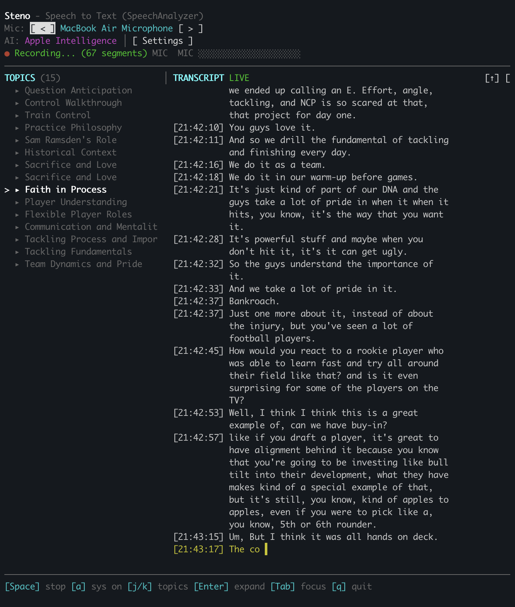

# Steno

A fast, private speech-to-text TUI for macOS.

Steno uses Apple's SpeechAnalyzer API (macOS 26) for real-time transcription that runs entirely on-device. No cloud services, no API keys, no rate limits.



## Architecture

Steno is a two-process system: a Swift daemon handles audio capture, speech recognition, and AI-powered topic extraction, while a Go TUI provides the interactive terminal interface.

```
┌─────────────────┐         Unix socket          ┌──────────────────────┐
│   steno-tui     │◄──── NDJSON commands ────────►│   steno-daemon       │
│   (Go/bubbletea)│◄──── NDJSON events ──────────►│   (Swift)            │
│                 │                               │                      │
│  - Live display │                               │  - Microphone capture│
│  - Topic panel  │      SQLite (read-only)       │  - System audio      │
│  - Level meters │◄─────────────────────────────►│  - SpeechAnalyzer    │
│  - Scrollback   │                               │  - Topic extraction  │
└─────────────────┘                               │  - Segment storage   │
                                                  └──────────────────────┘
```

The daemon runs as a background service. The TUI connects via Unix socket at `~/Library/Application Support/Steno/steno.sock` and reads persisted topics from SQLite.

## Requirements

- macOS 26 (Tahoe) or later
- Microphone access

## Installation

### From Source

Requires Swift 6.2+ and Go 1.24+.

```bash
git clone https://github.com/jwulff/steno.git
cd steno

# Build daemon
cd daemon && swift build -c release
# Binary: daemon/.build/release/steno-daemon

# Build TUI
cd ../tui && go build -o steno-tui .
```

### Install Daemon as launchd Service

```bash
steno-daemon install
```

This creates a launchd plist that starts the daemon automatically on login.

### Signed Binary

For microphone access without Gatekeeper warnings:

```bash
cd daemon
swift build -c release
codesign --force --sign - \
  --entitlements ../Resources/Steno.entitlements \
  .build/release/steno-daemon
```

## Usage

```bash
# Start the daemon (foreground)
steno-daemon run

# In another terminal, start the TUI
cd tui && go run .
```

### Controls

| Key | Action |
|-----|--------|
| `Space` | Start/stop recording |
| `i` | Cycle input devices |
| `a` | Toggle system audio capture |
| `Tab` | Switch panel focus (topics/transcript) |
| `j`/`k` | Navigate topics |
| `Enter` | Expand/collapse topic |
| `Up`/`Down` | Scroll transcript |
| `q` | Quit |

## How It Works

Steno uses the SpeechAnalyzer API introduced in macOS 26, which provides:

- **On-device processing** - Your audio never leaves your Mac
- **Low latency** - Real-time transcription as you speak
- **High accuracy** - 55% faster than Whisper Large V3 Turbo in Apple's benchmarks

The daemon captures audio from the microphone (and optionally system audio via ScreenCaptureKit), runs it through SpeechAnalyzer for transcription, persists segments to SQLite, and extracts topics using on-device LLMs. The TUI subscribes to a live event stream for real-time display.

## Project Structure

```
steno/
├── daemon/                    # Swift daemon (steno-daemon)
│   ├── Package.swift
│   ├── Sources/StenoDaemon/
│   │   ├── Audio/             # Mic + system audio capture
│   │   ├── Commands/          # CLI subcommands (run, status, install)
│   │   ├── Dispatch/          # Command dispatcher, event broadcaster
│   │   ├── Engine/            # Recording engine, speech recognizer
│   │   ├── Infrastructure/    # Paths, PID file, signal handling
│   │   ├── Models/            # Domain models
│   │   ├── Permissions/       # TCC permission checks
│   │   ├── Services/          # Summarization, topic extraction
│   │   ├── Socket/            # Unix socket server, NDJSON protocol
│   │   └── Storage/           # SQLite via GRDB
│   └── Tests/StenoDaemonTests/
├── tui/                       # Go TUI (steno-tui)
│   ├── go.mod
│   ├── main.go
│   └── internal/
│       ├── app/               # Bubbletea model, messages, keybindings
│       ├── daemon/            # Unix socket client, protocol types
│       ├── db/                # SQLite read-only queries (topics)
│       └── ui/                # Lipgloss styles
├── schema/                    # SQLite schema contract
├── Sources/Steno/             # Original Swift TUI (legacy)
└── Tests/StenoTests/
```

## Development

```bash
# Run daemon tests
cd daemon && swift test

# Run TUI tests
cd tui && go test ./...
```

See [CLAUDE.md](CLAUDE.md) for development conventions.

## License

MIT
