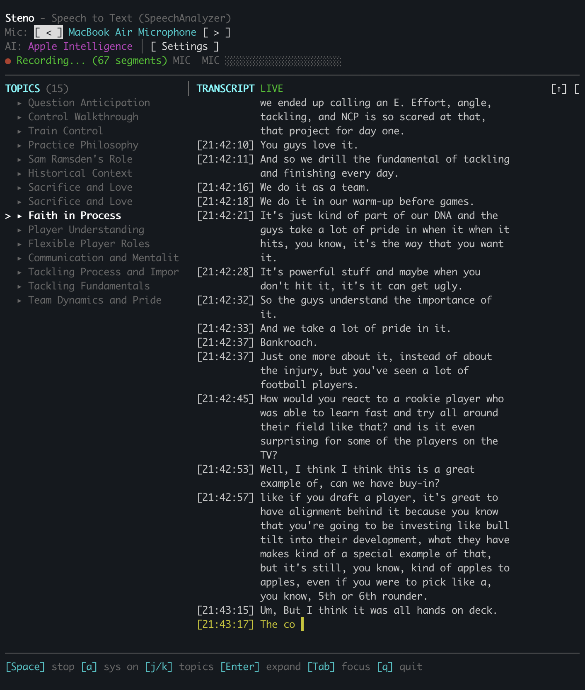

# Steno

A fast, private speech-to-text TUI for macOS.

Steno uses Apple's SpeechAnalyzer API (macOS 26) for real-time transcription that runs entirely on-device. No cloud services, no API keys, no rate limits.



## Requirements

- macOS 26 (Tahoe) or later
- Apple Silicon (arm64)
- Microphone access

## Install

### Download (recommended)

Download the latest release from [GitHub Releases](https://github.com/jwulff/steno/releases/latest):

```bash
# Download and extract
curl -LO https://github.com/jwulff/steno/releases/latest/download/steno-darwin-arm64.tar.gz
tar xzf steno-darwin-arm64.tar.gz

# Install to ~/.local/bin (make sure it's in your PATH)
mkdir -p ~/.local/bin
mv steno steno-daemon ~/.local/bin/
```

### From source

Requires Swift 6.2+ and Go 1.24+.

```bash
git clone https://github.com/jwulff/steno.git
cd steno
make install   # Builds, signs, and installs to ~/.local/bin
```

## Usage

```bash
steno            # Launch TUI — auto-starts the daemon
steno --mcp      # Run as MCP stdio server (for Claude Desktop, etc.)
```

That's it. Running `steno` automatically starts the daemon in the background if it isn't already running. The daemon survives after you quit the TUI — it keeps recording and persisting transcripts to SQLite.

### Controls

| Key | Action |
|-----|--------|
| `Space` | Start/stop recording |
| `i` | Cycle input devices |
| `a` | Toggle system audio capture |
| `Tab` | Switch panel focus (topics/transcript) |
| `j`/`k` | Navigate topics |
| `Enter` | Expand/collapse topic |
| `Up`/`Down` | Scroll transcript |
| `q` | Quit |

### MCP Server

Steno includes a built-in [MCP](https://modelcontextprotocol.io) server for querying your transcript database from AI tools like Claude Desktop.

Add to your MCP client config:

```json
{
  "mcpServers": {
    "steno": {
      "command": "steno",
      "args": ["--mcp"]
    }
  }
}
```

Available tools: `get_overview`, `list_sessions`, `get_session`, `get_transcript`, `search`.

### Daemon Management

The daemon runs as a background process. You can also manage it independently:

```bash
steno-daemon run         # Run daemon in foreground
steno-daemon status      # Check if daemon is running
steno-daemon install     # Install as launchd service (auto-start on login)
steno-daemon uninstall   # Remove launchd service
```

## How It Works

Steno uses the SpeechAnalyzer API introduced in macOS 26, which provides:

- **On-device processing** — your audio never leaves your Mac
- **Low latency** — real-time transcription as you speak
- **High accuracy** — 55% faster than Whisper Large V3 Turbo in Apple's benchmarks

## Architecture

Steno is a two-process system: a Swift daemon handles audio capture and speech recognition, while a Go binary provides the TUI and MCP server.

```
┌─────────────────┐         Unix socket          ┌──────────────────────┐
│   steno         │◄──── NDJSON commands ────────►│   steno-daemon       │
│   (Go)          │◄──── NDJSON events ──────────►│   (Swift)            │
│                 │                               │                      │
│  - TUI display  │                               │  - Microphone capture│
│  - MCP server   │      SQLite (read-only)       │  - System audio      │
│  - Daemon mgmt  │◄─────────────────────────────►│  - SpeechAnalyzer    │
│  - Level meters │                               │  - Topic extraction  │
└─────────────────┘                               │  - Segment storage   │
                                                  └──────────────────────┘
```

- **`steno`** (Go) — TUI + MCP server + daemon lifecycle management. Connects to the daemon via Unix socket, reads topics from SQLite.
- **`steno-daemon`** (Swift) — Captures mic + system audio via ScreenCaptureKit, runs SpeechAnalyzer/SpeechTranscriber, persists segments to SQLite (GRDB), extracts topics via on-device LLMs.

## Project Structure

```
steno/
├── daemon/                    # Swift daemon (steno-daemon)
│   ├── Package.swift
│   ├── Sources/StenoDaemon/
│   │   ├── Audio/             # Mic + system audio capture
│   │   ├── Commands/          # CLI subcommands (run, status, install)
│   │   ├── Dispatch/          # Command dispatcher, event broadcaster
│   │   ├── Engine/            # Recording engine, speech recognizer
│   │   ├── Infrastructure/    # Paths, PID file, signal handling
│   │   ├── Models/            # Domain models
│   │   ├── Permissions/       # TCC permission checks
│   │   ├── Services/          # Summarization, topic extraction
│   │   ├── Socket/            # Unix socket server, NDJSON protocol
│   │   └── Storage/           # SQLite via GRDB
│   └── Tests/StenoDaemonTests/
├── cmd/steno/                 # Go binary (steno)
│   ├── go.mod
│   ├── main.go                # Entry point: --mcp flag dispatches mode
│   └── internal/
│       ├── app/               # Bubbletea TUI model, messages, keybindings
│       ├── daemon/            # Socket client, protocol types, lifecycle manager
│       ├── db/                # SQLite read-only queries (shared by TUI + MCP)
│       ├── mcp/               # MCP tool handlers
│       └── ui/                # Lipgloss styles
└── schema/                    # SQLite schema contract
```

## Development

```bash
make build          # Build daemon (release) + steno
make test           # Run all test suites (daemon + steno)
make test-daemon    # Daemon tests only (Swift)
make test-steno     # Steno tests only (Go)
make run-daemon     # Build, sign, and run daemon (debug)
make run-steno      # Build and run TUI
make run-mcp        # Build and run MCP server
make clean          # Remove all build artifacts
make install        # Install to ~/.local/bin (override with PREFIX=)
```

See [CLAUDE.md](CLAUDE.md) for development conventions.

## License

MIT
