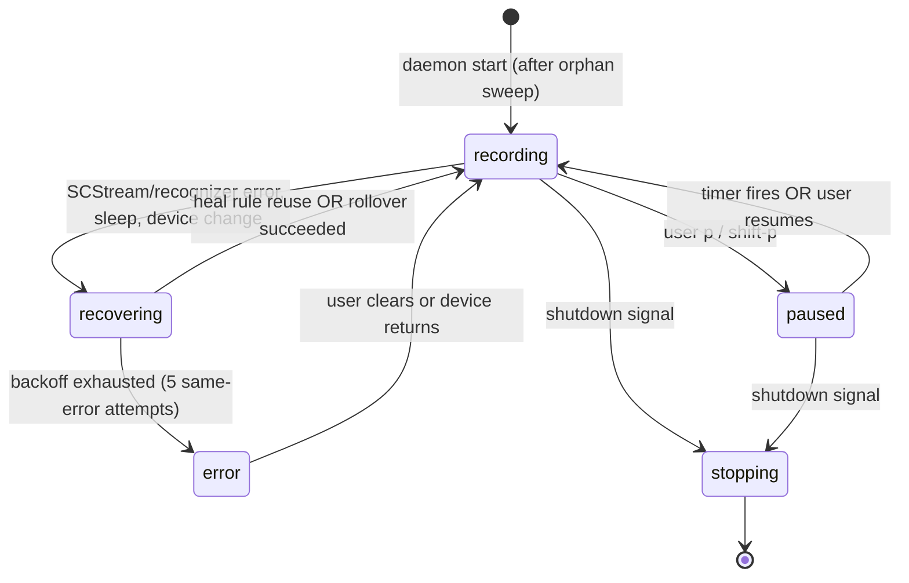
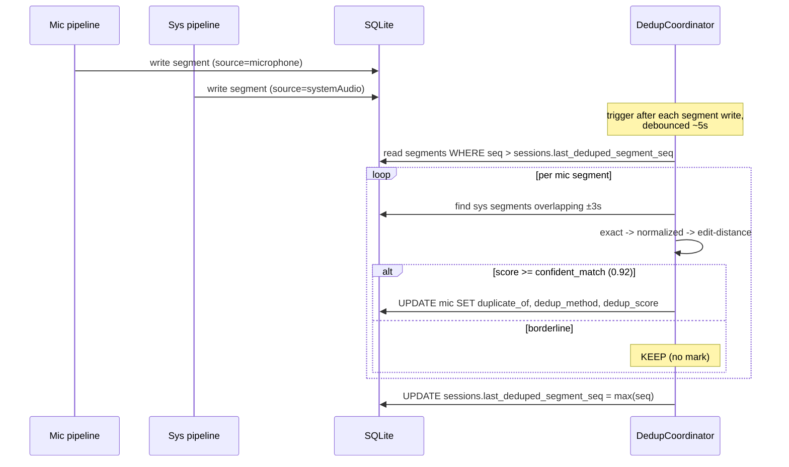

# feat: Always-on recording, self-healing, and cross-source dedup

## Overview

Shift Steno from a manual start/stop recorder to an **always-on capture daemon** that records continuously, self-heals across system events without losing data, and deduplicates the mic/system-audio overlap at storage time. Spacebar in the TUI is repurposed from a record toggle to a session demarcation action; a new `p` keybind provides a privacy pause with auto-resume.

The user-visible value: it becomes effectively impossible to "forget to start recording" or to silently lose a session to a sleep/wake cycle, AirPods reconnect, or recognizer crash, while remaining easy to pause when privacy is needed.

---

## Problem Frame

The daemon currently launches `idle`. The TUI's spacebar is the only path to start recording, and any error (SpeechAnalyzer crash, SCStream interruption, audio device change, sleep/wake) leaves the session dead until the user notices and manually restarts. Daemon crashes leave sessions stuck in `status=active` in the database. There is no mic/system-audio dedup, no empty-session cleanup, and no observable health beyond a binary connected/disconnected indicator.

The brainstorm at `docs/brainstorms/2026-04-25-always-on-recording-brainstorm.md` resolved the four load-bearing product decisions:

1. **Capture model:** continuous stream, sessions = wall-to-wall containers (every segment belongs to exactly one session; spacebar atomically closes one and opens the next).
2. **Pause model:** hard pause via `p` (default 30-min auto-resume, wall-clock based, runs through sleep) + `shift-p` for indefinite pause.
3. **Heal boundary:** hybrid 30s + device-change rule. Short, same-device gaps reuse the current session; long or device-changed gaps roll to a fresh session marked `interrupted`.
4. **Dedup model:** write both mic and sys segments, mark the mic side as `duplicate_of` when high-confidence text match within ±3s overlap. Cheap fuzzy only (no LLM tier in v1). Default-to-keep on borderline. Reversible.

This plan implements all four plus empty-session pruning, a new health surface in the TUI, and the supervisor logic the always-on model requires.

---

## Requirements Trace

- **R1.** Daemon is always recording when not paused — never lands in an off state by accident. (origin: brainstorm "What We're Building")
- **R2.** Spacebar in the TUI atomically closes the current session and opens a fresh one with no gap and no audio loss across the boundary.
- **R3.** A new `p` keybind hard-pauses both mic and system audio (no audio captured at all while paused), with a default 30-minute wall-clock auto-resume. `shift-p` pauses indefinitely.
- **R4.** Pause across sleep: stay paused on wake; auto-resume timer keeps counting through sleep using wall-clock time.
- **R5.** Self-healing on **system sleep/wake**: cleanly tear down pipelines on `willSleep`; rebuild on `didWake`; apply heal rule (gap < 30s + same input device → reuse session; else roll over with `interrupted` status on the closing session).
- **R6.** Self-healing on **mic device change** (AirPods disconnect, USB unplug, etc.): rebuild the AVAudioEngine + SpeechAnalyzer, debounce rapid back-to-back changes, treat any device-UID change as device-changed for the heal rule.
- **R7.** Self-healing on **SCStream interruption** (another app captures audio, system kills the stream): bounded backoff retry (1s, 2s, 4s, 8s, capped at 30s; give up after 5 consecutive same-error attempts and surface a non-transient health warning). Mic continues independently.
- **R8.** Self-healing on **SpeechAnalyzer recognizer error**: same backoff curve; restart that recognizer without stopping the rest of the recording.
- **R9.** Daemon process restart (LaunchAgent relaunch after crash, or login): on start, mark any pre-existing `active` sessions as `interrupted` and immediately open a fresh active session.
- **R10.** Cross-source dedup: persist both mic and system-audio segments always; a background pass within ~5s of segment finalization marks mic segments as `duplicate_of:<sys_segment_id>` when high-confidence text match within ±3s overlap. TUI/MCP queries default to filtering duplicates.
- **R11.** Empty-session auto-prune at close: delete sessions with zero segments OR < 20 chars non-duplicate text OR < 3s wall-clock duration.
- **R12.** TUI health surface: status bar shows one of `● REC`, `⏸ PAUSED — resumes in HH:MM`, `⏸ PAUSED — manual resume only`, `⚠ RECOVERING — gap Ns`, `✗ FAILED — see error`, plus a "last segment Ns ago" indicator that escalates to a warning above 60s while not paused. Heal markers appear inline in the segment timeline.
- **R13.** No regressions to existing data: schema changes are additive; existing segments and sessions remain queryable; the `duplicate_of` column is reversible (blanking it restores the raw two-stream view).

---

## Scope Boundaries

- **Quiet-hours scheduling** is out — manual pause covers the immediate need.
- **App- or device-aware automatic pause** (1Password frontmost, etc.) is out.
- **Retroactive editing of session boundaries** (merge/split/retitle past sessions) is out.
- **Historical re-dedup of pre-existing segments** is out — only new segments captured after this lands flow through the dedup pass.
- **Backfilling heal markers** on segments captured before this change is out.
- **LLM-based dedup tier** is out for v1; the schema reserves `dedup_method` so a future LLM tier can be added without re-migrating.
- **Cloud sync / remote storage** is out (privacy + scope).
- **Multi-user / shared session models** are out.

### Deferred to Follow-Up Work

- **Disk-growth retention policy** (auto-deletion past N days, archival, etc.): explicitly deferred. v1 keeps everything forever and ships an explicit follow-up to design retention once we have real always-on-day disk-growth measurements. Tracked as Risk #2 below.
- **Battery/thermal measurement** of always-on operation: a one-day baseline measurement is part of U6 verification, but if the result reveals problems (e.g., need for `ProcessType=Interactive` in launchd, or QoS class adjustments), the optimization itself is deferred.

---

## Context & Research

### Relevant Code and Patterns

- `daemon/Sources/StenoDaemon/Engine/RecordingEngine.swift` — the actor that owns recording lifecycle; the seam where the new supervisor methods live. Today's `handleRecognizerError(_:)` (~line 257) only emits a transient error and lets the recognizer task die — extending it to "emit AND restart with bounded backoff" is the most concrete present-vs-target gap.
- `daemon/Sources/StenoDaemon/Engine/RecordingEngineDelegate.swift` — `EngineStatus` enum (`idle`, `starting`, `recording`, `stopping`, `error`); needs new states `paused` and `recovering`. `RecordingEvent` cases are the channel for new `health`, `recovering`, and `healed` events.
- `daemon/Sources/StenoDaemon/Audio/SystemAudioSource.swift` — SCStream owner; needs error-code-aware delegate handling (currently the stream is constructed with `delegate: nil`) and rebuild-with-backoff logic. The `streamOutput` is already stored as an instance property — preserve that pattern through rebuild (`SCStream` retains outputs weakly, so a local-variable output would silently fail).
- `daemon/Sources/StenoDaemon/Engine/DefaultAudioSourceFactory.swift` — currently builds an `AVAudioEngine` inline; the rebuild path needs to live in a longer-lived helper that survives engine teardown.
- `daemon/Sources/StenoDaemon/Storage/DatabaseConfiguration.swift` — GRDB migration registration (lines 61, 110, 116). Migrations follow `YYYYMMDD_NNN_description` naming; next is `20260425_001_*`.
- `daemon/Sources/StenoDaemon/Storage/SQLiteTranscriptRepository.swift` — single per-segment write path; new dedup queries and the heal-marker write extend this layer.
- `daemon/Sources/StenoDaemon/Services/RollingSummaryCoordinator.swift` — the canonical "load → filter uncovered → process → persist" cursor pattern; the dedup background worker mirrors this shape with a per-session `last_deduped_segment_seq` cursor for idempotent restart.
- `daemon/Sources/StenoDaemon/Services/SummarizationService.swift` + `FoundationModelSummarizationService.swift` + `AnthropicSummarizationService.swift` — protocol-with-two-backends pattern; future LLM dedup tier can mirror this if it's ever added.
- `daemon/Sources/StenoDaemon/Infrastructure/LaunchdPlist.swift` (lines 29-33) — `KeepAlive { SuccessfulExit = false }`. Audit `SignalHandler.swift` to confirm unexpected exits propagate non-zero so launchd actually relaunches.
- `daemon/Sources/StenoDaemon/Infrastructure/SignalHandler.swift` — exit-code policy lives here.
- `daemon/Sources/StenoDaemon/Commands/RunCommand.swift` — `ParsableCommand` + `dispatchMain()` is the load-bearing runtime structure; new IOKit power source must register against `DispatchQueue.main` (via `IONotificationPortSetDispatchQueue`) from this same boundary, not from inside the actor. **Do NOT use `CFRunLoopAddSource(CFRunLoopGetMain(), ...)` — `dispatchMain()` parks the main thread on libdispatch and never pumps a CFRunLoop, so CFRunLoop-registered sources never fire.**
- `daemon/Sources/StenoDaemon/Dispatch/EventBroadcaster.swift` — adds new event types (`health`, `recovering`, `healed`).
- `daemon/Sources/StenoDaemon/Socket/DaemonProtocol.swift` — adds new commands (`pause`, `resume`, `demarcate`) and event payloads.
- `cmd/steno/internal/daemon/protocol.go` — Go-side mirror of the new commands and events.
- `cmd/steno/internal/app/model.go` (lines 549–561, 742–767, 1060–1062) — spacebar binding, status bar rendering, error bar; central to the TUI changes.
- `cmd/steno/internal/db/store.go` — read-only SQLite reader; new dedup-aware queries must default to `WHERE duplicate_of IS NULL`.
- `schema/README.md` — the contract between the Swift writer and the Go reader; updated in lockstep with any schema migration.
- `daemon/Tests/StenoDaemonTests/Engine/` and `daemon/Tests/StenoDaemonTests/Mocks/` — Swift Testing framework with mock factories for engine-level testing; pattern to follow for new supervisor tests.

### Institutional Learnings

- This repo uses `changes/` for institutional knowledge (no `docs/solutions/` directory exists). Capture a `changes/2026-04-25-always-on-recording.md` retrospective when this lands.
- **SpeechAnalyzer must run on `@MainActor` with `dispatchMain()` keeping the main RunLoop alive** — every restart path must funnel through `Task { @MainActor in ... }.value`. Off-main starts SIGTRAP (origin: `changes/2026-02-08-1400-steno-daemon.md`, `CLAUDE.md` "macOS 26 Speech API Notes"). **Never fall back to `SFSpeechRecognizer`** — the fix for any SpeechAnalyzer issue is to repair the runtime environment, not downgrade APIs.
- **SCStream was deliberately chosen over Core Audio process taps** because Core Audio Taps don't surface in TCC for CLI binaries (origin: `changes/2026-02-07-multi-source-audio-capture.md`). Don't revisit during planning — and expect SCStream restarts to flicker the macOS orange recording indicator, which the user will see during heals.
- **Topic stability pattern (PR #10)** — additive, immutable, non-destructive. The same posture applies to dedup marks: write-once advisory metadata, never silently flip back.
- **GRDB migration pattern** — register in `DatabaseConfiguration.swift`, document in `schema/README.md`, extend `cmd/steno/internal/db/models.go` in lockstep. **WAL must be explicitly enabled on the writer** — today's `DatabaseConfiguration` only sets `PRAGMA foreign_keys = ON`, and a read-only DSN cannot change `journal_mode`. U2 adds `PRAGMA journal_mode = WAL` to `prepareDatabase` so concurrent reads from the Go TUI don't serialize against migration writes.
- **Multi-source v1 plan precedent** — risky unknowns got a throwaway-prototype spike before commitment. The same approach applies to SpeechAnalyzer sleep/wake behavior (Risk #4 from brainstorm). U1 below is that spike.

### External References

- [IORegisterForSystemPower / system power notifications](https://developer.apple.com/forums/thread/770517) — the right channel for daemon sleep/wake (NSWorkspace is AppKit-only).
- [kIOPMAssertionTypePreventUserIdleSystemSleep](https://developer.apple.com/documentation/iokit/kiopmassertiontypepreventuseridlesystemsleep) — power assertion to prevent idle sleep while actively recording. Take only when recording, release immediately on stop/pause.
- [SpeechAnalyzer reference](https://developer.apple.com/documentation/speech/speechanalyzer) — sessions are one-shot. `finalizeAndFinishThroughEndOfInput()` ends the session; rebuild from scratch on resume.
- [AVAudioEngineConfigurationChangeNotification](https://developer.apple.com/documentation/avfaudio/avaudioengineconfigurationchangenotification) — fires on input device change. Engine has already stopped by the time you receive it; rebuild rather than mutate.
- [SCStreamError.Code](https://developer.apple.com/documentation/screencapturekit/scstreamerror/code) — error-code dispatch for `SCStreamDelegate.stream(_:didStopWithError:)`. `-3805 connectionInvalid`, `-3815 noCaptureSource`, `-3821 systemStoppedStream` are the primary recovery paths.
- [pyobjc #647 — SCStream weak-reference gotcha](https://github.com/ronaldoussoren/pyobjc/issues/647) — `SCStream` retains stream outputs weakly; storing only as a local variable causes silent failures.
- [audiodog.co.uk — Core Audio interruption recovery](https://www.audiodog.co.uk/blog/2021/07/11/correct-way-to-recover-from-core-audio-interruptions/) — practical pattern for AVAudioEngine rebuild + tap reinstall.

---

## Key Technical Decisions

- **Sleep/wake: IOKit, not NSWorkspace.** Daemon is a launchd-managed CLI binary; linking AppKit is wrong. Use `IORegisterForSystemPower` and route the notification port through libdispatch via `IONotificationPortSetDispatchQueue(port, DispatchQueue.main)`. CFRunLoop registration (`CFRunLoopAddSource(CFRunLoopGetMain(), ...)`) is incompatible with the daemon's `dispatchMain()` runtime — the main thread is owned by libdispatch and CFRunLoop sources never pump. Respond synchronously on `kIOMessageSystemWillSleep` (within ~30s budget) — drain SpeechAnalyzer, stop SCStream, persist in-flight, then `IOAllowPowerChange`.
- **SpeechAnalyzer is one-shot.** Treat every interruption (sleep, device change, recognizer error, spacebar boundary) as session-ending for the analyzer. Always rebuild a fresh `SpeechTranscriber` + `SpeechAnalyzer` + `AsyncStream<AnalyzerInput>` on resume. No "pause" attempt — that path doesn't exist in the API.
- **AVAudioEngine: full rebuild on configuration change**, not in-place mutation. Debounce rapid back-to-back notifications by ~250ms (Bluetooth renegotiation produces bursts). Compare device UID before/after to distinguish "device changed" (full session-rollover candidate) from "format changed within same device" (cheaper re-tap path; still triggers heal rule because format affects the analyzer).
- **SCStream: error-code dispatch, fresh `SCShareableContent` on every rebuild.** Cached display/app references go stale and re-fail immediately. Strongly retain stream outputs as stored properties.
- **Power assertion only while actively recording**, taken via `IOPMAssertionCreateWithName` with a clear name visible in `pmset -g assertions`. Released immediately on pause, sleep-initiated stop, or user stop.
- **Recording state machine extended.** New `EngineStatus` cases: `paused`, `recovering`. `idle` retains its meaning (never been started or fully torn down) but in always-on mode the daemon never voluntarily reaches `idle` after first launch — only `recording`, `paused`, `recovering`, or `error`.
- **Pause is hard.** No audio capture, no transcription, no DB writes while paused. Wall-clock auto-resume timer (so it ticks through sleep). Pause closes the current session cleanly and resume opens a fresh one — the pause window is itself a session boundary.
- **Spacebar atomicity via timestamp routing.** Spacebar at time T closes the current session and opens a new one at T. In-flight partial transcriptions are routed by their **start timestamp**: started-before-T → attributed to closing session even if finalized after T; started-at-or-after-T → new session. This avoids ambiguity without forcing a teardown of the analyzer at every spacebar tap. **Definition of "start timestamp" (load-bearing):** the wall-clock moment of the FIRST audio frame that contributed to this segment, not the recognizer's internal frame index, not the volatile-partial first-emission, and not the finalization moment. The `SpeechRecognizerFactory` protocol contract must require this semantics on `result.timestamp`. **U1 spike must empirically verify** what `SpeechAnalyzer` actually populates here on macOS 26 — if reality differs from the contract, escalate before U10 ships and consider Approach (b): plumb wall-clock timestamps through the audio path independent of the recognizer.
- **Heal rule is local to one event.** It does not chain. If a wake-from-sleep gap is < 30s + same device, we heal in place; if a second event (device change) hits 5s later, that's a new evaluation that may roll the session. Marker columns let the TUI display this honestly.
- **Dedup is a background pass with a per-session cursor.** Mirror `RollingSummaryCoordinator`'s pattern: each session row carries `last_deduped_segment_seq`; the worker scans new mic segments since the cursor against time-overlapping sys segments. Idempotent across daemon restarts.
- **Dedup similarity is cheap and tiered, no LLM.** Exact match → normalized-string match (lowercased, punctuation-stripped, whitespace-collapsed) → edit-distance ratio. High-confidence threshold (start at 0.92, conservative). Borderline → KEEP. The `dedup_method` column records which tier matched.
- **Empty-session prune is a write-time decision.** At session close, count segments + non-dup char total + duration; if any of the three thresholds trips, delete cascade. No background sweep.
- **Device-change detection compares Core Audio UID** (`kAudioHardwarePropertyDefaultInputDevice`) before and after the configuration-change notification fires.
- **Daemon-start sweep:** any session with `status='active'` and `endedAt IS NULL` at daemon start is an orphan from a prior dead daemon. Mark it `interrupted` with `endedAt = max(last segment endedAt, startedAt)`. Then open a fresh active session.
- **Threat model (single-user local tool):** the Unix socket at `~/Library/Application Support/Steno/steno.sock` is created with `0600` permissions (owner read/write only) — set via `umask` before `bind` or via explicit `chmod` after. The SQLite database at the same directory is created with `0600`. Socket commands are deliberately unauthenticated within the owner's UID — same-user processes are trusted. This is the explicit threat model: the daemon defends against other users on the same machine, not against malicious code already running as the user. Privilege escalation via a compromised same-user process (e.g., `{"cmd":"resume"}` to cancel a privacy pause) is accepted as out-of-scope.

---

## Open Questions

### Resolved During Planning

- **Sleep/wake mechanism** → IOKit `IORegisterForSystemPower`, not NSWorkspace.
- **Should we use `SCStreamConfiguration.captureMicrophone` to combine mic + sys in one stream?** → No. Single-stream concentrates failure (mic dies when SCK dies). Keep mic on AVAudioEngine and sys on SCStream.
- **Spacebar boundary atomicity** → timestamp-based routing of in-flight segments; no analyzer rebuild at the boundary.
- **Dedup cursor strategy** → per-session `last_deduped_segment_seq` column on `sessions`, mirroring `RollingSummaryCoordinator`.
- **Whether to backfill heal markers / re-dedup historical data** → No (out of scope, brainstorm-confirmed).
- **Where new commands live in the protocol** → `pause`, `resume`, `demarcate` added to `daemon/Sources/StenoDaemon/Socket/DaemonProtocol.swift` and mirrored in `cmd/steno/internal/daemon/protocol.go`.

### Deferred to Implementation

- **Exact dedup similarity threshold** — start at 0.92 edit-distance ratio; tune in U11 against real captured data once available. Configuration-driven so it's a flag, not a recompile.
- **Exact "stale recognizer" threshold** in the health surface (currently spec'd as "60s without a segment while not paused"). Implementer should sanity-check against typical silent stretches in real use; may need to be 90s or 120s.
- **Whether `ProcessType=Interactive` should be added to the LaunchAgent plist** to prevent thermal throttling. Decision deferred until U6 verification produces an always-on day's energy profile. If throttling is observed, follow-up plan adds the flag.
- **Auto-resume timer persistence across daemon restart.** If the daemon is killed (or crashes) at minute 14 of a 30-min auto-pause, what does the relaunched daemon do? Leaning toward: persist `pause_expires_at` to the DB on pause; daemon-start sweep checks it; if expired → resume into fresh session, if not → re-arm timer. Implementer to confirm this is the right call once the pause command lands; it's a small extension to U10 if needed.
- **Heal-marker placement is resolved:** in-place heals get `segments.heal_marker='after_gap:<N>s'` on the first segment after recovery (R5 hybrid path); session rollovers get `sessions.status='interrupted'` on the closing session. The `opened_by` enum that would have explicitly tagged the cause of every new session is deferred (no reader in this plan).

---

## Output Structure

This plan modifies existing files predominantly; new files are added in established directories. No new top-level structure.

```
daemon/Sources/StenoDaemon/
├── Engine/
│   ├── RecordingEngine.swift                   # MODIFY (state machine, restart-with-backoff, heal rule)
│   └── RecordingEngineDelegate.swift           # MODIFY (new EngineStatus cases, new event types)
├── Audio/
│   ├── SystemAudioSource.swift                 # MODIFY (error-code dispatch, rebuild-with-backoff)
│   └── MicrophoneAudioSource.swift             # CREATE (extracted from RecordingEngine for rebuild path)
├── Infrastructure/
│   ├── PowerManagementObserver.swift           # CREATE (IOKit sleep/wake)
│   ├── PowerAssertion.swift                    # CREATE (kIOPMAssertionTypePreventUserIdleSystemSleep helper)
│   ├── AudioDeviceObserver.swift               # CREATE (AVAudioEngineConfigurationChangeNotification + UID compare)
│   ├── PauseTimer.swift                        # CREATE (wall-clock auto-resume)
│   └── LaunchdPlist.swift                      # AUDIT (verify no plist changes needed beyond existing KeepAlive)
├── Commands/
│   └── RunCommand.swift                        # MODIFY (wire IOKit + AVAudioEngine observers into main RunLoop)
├── Services/
│   └── DedupCoordinator.swift                  # CREATE (background mic/sys dedup pass with per-session cursor; private similarityScore() function inlined)
├── Storage/
│   ├── Migrations/
│   │   └── 20260425_001_dedup_and_heal.swift   # CREATE (additive schema migration)
│   ├── DatabaseConfiguration.swift             # MODIFY (register new migration)
│   └── SQLiteTranscriptRepository.swift        # MODIFY (heal-marker write, dedup queries, cursor)
├── Models/
│   └── Session.swift                           # MODIFY (last_deduped_segment_seq, pause_expires_at, paused_indefinitely)
├── Socket/
│   └── DaemonProtocol.swift                    # MODIFY (pause / resume / demarcate commands; new event types)
└── Dispatch/
    └── EventBroadcaster.swift                  # MODIFY (broadcast health / recovering / healed events)

daemon/Tests/StenoDaemonTests/                   # MIRROR test files for each unit
schema/README.md                                 # MODIFY (document new columns)
cmd/steno/internal/
├── daemon/protocol.go                          # MODIFY (mirror new commands and events)
├── db/store.go                                 # MODIFY (default WHERE duplicate_of IS NULL on segment queries)
└── app/
    ├── model.go                                # MODIFY (spacebar = demarcate, p / shift-p, health surface)
    ├── messages.go                             # MODIFY (new tea.Msg types for health)
    └── keymap.go                               # MODIFY (new bindings)
changes/2026-04-25-always-on-recording.md       # CREATE (post-implementation retrospective)
```

The implementer may adjust file boundaries if implementation reveals a better seam — per-unit `**Files:**` sections below are authoritative.

---

## High-Level Technical Design

> *This illustrates the intended approach and is directional guidance for review, not implementation specification. The implementing agent should treat it as context, not code to reproduce.*

### Always-On Lifecycle State Machine



`idle` is removed from the steady-state vocabulary. The only path to a non-recording state in always-on mode is `paused` (deliberate) or `error` (backoff exhausted, surfaced loudly). `recovering` is a transient state with bounded backoff. The orphan sweep on daemon start ensures we never persist as `idle` past first launch.

### Heal-Rule Decision Flow

```mermaid
sequenceDiagram
    participant Sys as System (IOKit / AVAE)
    participant Sup as RecordingEngine (supervisor)
    participant Pipe as Audio + Speech pipelines
    participant DB as SQLite

    Sys->>Sup: kIOMessageSystemWillSleep<br/>OR configurationChangeNotification<br/>OR SCStream error
    Sup->>Pipe: drain & teardown (within 30s for sleep)
    Sup->>DB: persist in-flight segment, mark gap_started_at
    Note over Sup: enter recovering state, broadcast event
    Sys-->>Sup: didWake / config stable / backoff elapsed
    Sup->>Sup: compute gap_secs, current_device_uid
    alt gap < 30s AND device unchanged
        Sup->>Pipe: rebuild with same session
        Sup->>DB: write heal marker on next segment
    else gap >= 30s OR device changed
        Sup->>DB: close current session as 'interrupted'
        Sup->>DB: open new session (heal-rollover; opened_by deferred)
        Sup->>Pipe: rebuild
    end
    Sup-->>Sys: broadcast healed event with gap_secs
```

### Dedup Background Pass



The cursor is per-session so it survives daemon restart and never re-marks already-evaluated segments. The pass is idempotent: re-running it produces no changes.

---

## Implementation Units

- [ ] **U1. Sleep/wake + recognizer-restart spike**

**Goal:** Empirically validate the SpeechAnalyzer + SCStream + AVAudioEngine teardown/rebuild sequence across a real macOS 26 sleep/wake cycle and a real AirPods disconnect/reconnect, before committing to the supervisor design. Findings feed U5–U8.

**Requirements:** R5, R6, R7, R8 (de-risk before commit)

**Dependencies:** None

**Files:**
- Create (throwaway): `daemon/Sources/StenoDaemon/Spike/SleepWakeSpike.swift` — a short-lived spike target, deleted after findings are captured
- Update: `changes/2026-04-25-spike-sleep-wake-findings.md` — captures empirical timings, error codes, and any surprises

**Approach:**
- Stand up a minimal harness that: opens a SpeechAnalyzer + SCStream + AVAudioEngine, prints lifecycle events, sleeps the laptop manually, observes wake behavior; then disconnects AirPods, observes the AVAudioEngine notification + format change.
- Measure: time budget on `kIOMessageSystemWillSleep` before forced sleep, exact SCStream error codes seen on contention, AVAudioEngine configurationChange notification timing relative to actual device transition, whether SpeechAnalyzer's `finalizeAndFinishThroughEndOfInput()` cleanly drains in-flight input.
- **Also measure for U10:** what does SpeechAnalyzer's `result.timestamp` actually represent? (audio-frame start? volatile-partial first emission? finalization moment?) Document precisely. If it does NOT correspond to the audio-frame start, escalate to U10's plan author — the spacebar timestamp-routing contract depends on this.
- Document the empirical findings as the basis for U6–U8 implementation. If anything contradicts the external research summary in this plan, update the plan before proceeding.

**Execution note:** This is a research spike, not test-first feature work. Ship findings as a markdown doc, then delete the spike code.

**Patterns to follow:**
- Multi-source v1 plan precedent — throwaway prototype for risky unknowns (`docs/plans/2026-02-07-feat-multi-source-audio-capture-plan.md`).

**Test scenarios:**
- Test expectation: none — spike is exploratory; deliverable is a findings doc, not production code.

**Verification:**
- A `changes/2026-04-25-spike-sleep-wake-findings.md` doc exists with: measured `willSleep` budget, SCStream error codes seen under contention, AVAudioEngine config-change timing, SpeechAnalyzer drain behavior, and any deviations from the plan's external research summary.
- Spike code is deleted from the source tree (or clearly marked excluded from build).
- Plan is amended if findings invalidate any U5–U8 assumption.

---

- [ ] **U2. Schema migration: dedup columns, heal markers, session metadata**

**Goal:** Land the additive schema changes required by R5, R10, R11, R13. All columns are nullable additions; no destructive migration.

**Requirements:** R5, R10, R11, R13

**Dependencies:** None

**Files:**
- Create: `daemon/Sources/StenoDaemon/Storage/Migrations/20260425_001_dedup_and_heal.swift`
- Modify: `daemon/Sources/StenoDaemon/Storage/DatabaseConfiguration.swift` (register migration)
- Modify: `daemon/Sources/StenoDaemon/Storage/Records/SegmentRecord.swift` (new GRDB column mappings)
- Modify: `daemon/Sources/StenoDaemon/Storage/Records/SessionRecord.swift` (new GRDB column mappings)
- Modify: `daemon/Sources/StenoDaemon/Models/Session.swift` (`last_deduped_segment_seq`, `pause_expires_at`, `paused_indefinitely`)
- Modify: `schema/README.md` (document new columns)
- Modify: `cmd/steno/internal/db/models.go` (mirror new fields for the Go reader)
- Test: `daemon/Tests/StenoDaemonTests/Storage/MigrationTests.swift`

**Approach:**
- Add to `segments`: `duplicate_of TEXT NULL` (FK to `segments.id`), `dedup_method TEXT NULL` (`'exact'|'normalized'|'fuzzy'`), `heal_marker TEXT NULL` (e.g. `'after_gap:12s'` for in-place heals), `mic_peak_db REAL NULL` (peak dBFS during the mic segment; used by DedupCoordinator's audio-level heuristic to avoid dropping actively-spoken mic content). `dedup_method` alone covers diagnostic + reversibility — `dedup_score` is omitted as speculative; if a future LLM tier needs a confidence value it can be added then.
- Add to `sessions`: `last_deduped_segment_seq INTEGER NOT NULL DEFAULT 0`, `pause_expires_at REAL NULL`, `paused_indefinitely INTEGER NOT NULL DEFAULT 0` (boolean; `1` = pause has no auto-resume, `0` = either no pause OR auto-resume governed by `pause_expires_at`). The boolean is a privacy-critical disambiguator — see U10 for the daemon-start rule. The `opened_by` enum (`'daemon_start'|'user_demarcate'|'pause_resume'|'heal_rollover'`) is **deferred** — it has no reader in this plan, and `sessions.status='interrupted'` plus `segments.heal_marker` already cover all observability requirements in R12. Add `opened_by` in a follow-up that ships a session-browsing UI that actually queries it.
- Activate the existing `interrupted` value in the `sessions.status` enum (already documented in `schema/README.md` line 25 but unused).
- Index: `CREATE INDEX idx_segments_dedup ON segments(sessionId, sequenceNumber) WHERE duplicate_of IS NULL;` — keys on the columns the actual TUI/MCP default query uses (`WHERE sessionId=? AND duplicate_of IS NULL ORDER BY sequenceNumber`). The earlier draft of this plan had `(sessionId, source, startedAt)` which would not have accelerated the ORDER BY path.
- All migrations use GRDB's registered-migration pattern; existing rows get sensible defaults via the `DEFAULT` clause.
- **Enable WAL on the writer connection.** Add `PRAGMA journal_mode = WAL` to `DatabaseConfiguration.prepareDatabase` so the Go TUI's read connection (which already requests WAL via DSN) actually gets WAL semantics. Without this, the writer is in default rollback-journal mode and TUI reads serialize against migration writes — making the "additive, non-blocking" claim false.

**Execution note:** Test-first. Write the migration test before the migration. Confirms a fresh DB and an existing-data DB both end up at the new schema correctly.

**Patterns to follow:**
- Migration naming `YYYYMMDD_NNN_description` per `daemon/Sources/StenoDaemon/Storage/DatabaseConfiguration.swift` lines 61, 110, 116.
- `schema/README.md` is the contract — update in lockstep, don't lag.

**Test scenarios:**
- *Happy path:* Fresh DB after migration has all new columns with correct types and defaults. Verifies via PRAGMA table_info reads.
- *Happy path:* Existing DB with prior-schema sessions and segments runs the migration without error; existing rows get `last_deduped_segment_seq=0`, `paused_indefinitely=0`, NULL on optional columns.
- *Edge case:* Re-running the migration is a no-op (GRDB's `eraseDatabaseOnSchemaChange=false` path); idempotent.
- *Edge case:* Dedup index is created and is used by the planned default query (verify via EXPLAIN QUERY PLAN).
- *Integration:* After migration, the Go-side `db.Store` queries against `cmd/steno/internal/db/models.go` succeed against a daemon-written DB (ties to U9 verification).

**Verification:**
- New migration file registered, runs in CI.
- `schema/README.md` enumerates every new column with type, nullability, and meaning.
- Go `db.Store` builds and reads against a freshly-migrated DB.

---

- [ ] **U3. SignalHandler exit-code audit + LaunchAgent posture**

**Goal:** Confirm Assumed Default #9 — that `KeepAlive { SuccessfulExit = false }` actually relaunches on the failure modes we care about. Close any gap.

**Requirements:** R9

**Dependencies:** None

**Files:**
- Audit: `daemon/Sources/StenoDaemon/Infrastructure/SignalHandler.swift`
- Audit: `daemon/Sources/StenoDaemon/Infrastructure/LaunchdPlist.swift`
- Modify: `daemon/Sources/StenoDaemon/Infrastructure/SignalHandler.swift` if any unexpected-failure path exits with `0`
- Test: `daemon/Tests/StenoDaemonTests/Infrastructure/SignalHandlerTests.swift`

**Approach:**
- Read `SignalHandler.swift` end-to-end. For each terminating path, classify as expected (user `stop`, `SIGTERM` from launchctl) or unexpected (uncaught Swift error, unrecoverable engine fault). Confirm unexpected paths exit non-zero.
- **Add a macOS version gate at the `@main` entry point** (`StenoDaemon.swift` or `RunCommand.swift` before any SpeechAnalyzer/SCStream init). On pre-26 systems, refuse to start with a clear stderr message ("Steno requires macOS 26.0 or later — current: <version>") and exit non-zero. Without this, pre-26 systems silently spin in U5's backoff loop forever while the TUI shows `● REC`. Use `if #available(macOS 26.0, *)` and `@available(macOS 26.0, *)` consistently across daemon code paths.
- Decision deferred (per Open Questions): whether to add `ProcessType=Interactive` to the plist. Do not add in this unit; revisit after U6 measurement.

**Execution note:** Test-first for any code change. If the audit reveals nothing to fix, this unit is documentation-only — note that in the changes log entry.

**Patterns to follow:**
- Existing test patterns under `daemon/Tests/StenoDaemonTests/Infrastructure/`.

**Test scenarios:**
- *Happy path:* `SIGTERM` results in exit code 0 (expected shutdown — launchd will not relaunch).
- *Error path:* An unhandled engine fault exits non-zero (launchd will relaunch).
- *Edge case:* A `stop` command followed by a graceful shutdown still exits 0.
- *Error path (version gate):* Daemon launched on macOS 25.x → exits non-zero with message containing "macOS 26.0 or later"; LaunchAgent does not respawn into infinite-fail loop.
- *Happy path (version gate):* Daemon launched on macOS 26.0+ → version check passes; normal startup proceeds.

**Verification:**
- For every terminating path, the exit code matches the policy. Documented in code comments where non-obvious.

---

- [ ] **U4. Daemon-start orphan sweep + auto-open initial session**

**Goal:** On daemon start, mark any pre-existing `active` session as `interrupted` and immediately open a fresh active session. The daemon never lands in `idle` after first launch.

**Requirements:** R1, R9

**Dependencies:** U2 (schema)

**Files:**
- Modify: `daemon/Sources/StenoDaemon/Commands/RunCommand.swift` (call sweep + auto-start)
- Modify: `daemon/Sources/StenoDaemon/Engine/RecordingEngine.swift` (add `recoverOrphans()` and adjust `start()` for auto-start path)
- Modify: `daemon/Sources/StenoDaemon/Storage/SQLiteTranscriptRepository.swift` (orphan-sweep query)
- Test: `daemon/Tests/StenoDaemonTests/Engine/OrphanSweepTests.swift`
- Test: `daemon/Tests/StenoDaemonTests/Engine/AutoStartTests.swift`

**Approach:**
- Add `repository.recoverOrphansAndOpenFresh()` method that runs in a single SQLite transaction: `UPDATE sessions SET status='interrupted', endedAt=COALESCE((SELECT MAX(endedAt) FROM segments WHERE sessionId=sessions.id), startedAt) WHERE status='active'`, then `INSERT` the new active session, all atomically. Wrapping in one transaction prevents the race where a concurrent willSleep handler (or any other writer) sees the half-state between sweep and new-session-insert. Also prevents the UPDATE from accidentally matching the just-inserted new row.
- Add `RecordingEngine.recoverOrphansAndAutoStart()` that calls the repository method, then enters the normal `start()` flow with the returned new session.
- `RunCommand.swift`'s post-launch sequence calls this immediately after engine init — there is no longer a wait for an explicit `start` command from the TUI. **Sequencing relative to power observer:** install the IOKit power observer BEFORE calling `recoverOrphansAndAutoStart()`, so a willSleep arriving during the sweep is queued (the actor serializes), not lost.
- **Pause-state restore on start (privacy-critical, ties to U10):** before opening a fresh active session, check the most-recently-modified session's `paused_indefinitely` and `pause_expires_at`. If `paused_indefinitely=1` → enter paused state with no auto-resume. If `pause_expires_at` is in the future → enter paused state with re-armed timer. Else → open fresh active session as normal.
- The auto-started session uses the user's last-known device + systemAudio settings (persist these in `Models/StenoSettings.swift` when last set; default to `MacBook Pro Microphone` + `systemAudio=true`).

**Execution note:** Test-first.

**Patterns to follow:**
- `Models/StenoSettings.swift` already exists for daemon-side persistent settings — use it for last-known device.

**Test scenarios:**
- *Happy path:* Daemon starts with no prior sessions → opens a fresh `active` session.
- *Happy path:* Daemon starts with one stranded `active` session → that session becomes `interrupted` with `endedAt` = last segment's `endedAt`; a fresh session is opened.
- *Edge case:* Daemon starts with a stranded `active` session that has zero segments → the orphan is `interrupted` with `endedAt=startedAt`, then it's eligible for the empty-session pruner (defer cascade-delete to U12; just close it correctly here).
- *Edge case:* Daemon starts with multiple stranded `active` sessions (shouldn't happen but possible) → all are marked `interrupted`, fresh session is opened.
- *Edge case (race):* Orphan sweep + new-session-insert wrapped in a single transaction → concurrent writes during the sweep do not see the half-state; the UPDATE does not match the just-inserted new session.
- *Error path:* Auto-start fails (e.g., mic permission denied) → engine enters `error` state with a non-transient health event; orphan sweep still ran successfully.
- *Integration:* TUI connecting to a freshly-started daemon sees `recording` status and the new session's ID, not `idle`.

**Verification:**
- After daemon start, `status` is `recording` (or `error` with a clear message, never `idle`).
- DB contains exactly one `status='active'` session at any post-start moment (until further events).

---

- [ ] **U5. Pipeline restart-with-bounded-backoff in RecordingEngine**

**Goal:** Replace today's no-op `handleRecognizerError(_:)` with a real restart loop. Provide a reusable backoff helper used by U6, U7, U8.

**Requirements:** R7, R8

**Dependencies:** U2 (heal-marker write); U1 findings confirm the rebuild sequence

**Files:**
- Modify: `daemon/Sources/StenoDaemon/Engine/RecordingEngine.swift` (add `restartMicPipeline(reason:)`, `restartSystemPipeline(reason:)`, backoff state)
- Create: `daemon/Sources/StenoDaemon/Engine/BackoffPolicy.swift` (1s/2s/4s/8s capped at 30s; max 5 same-error attempts before surrender)
- Modify: `daemon/Sources/StenoDaemon/Engine/RecordingEngineDelegate.swift` (new `EngineStatus.recovering` and event types `recovering`, `healed`, `recoveryExhausted`)
- Test: `daemon/Tests/StenoDaemonTests/Engine/BackoffPolicyTests.swift`
- Test: `daemon/Tests/StenoDaemonTests/Engine/PipelineRestartTests.swift`

**Approach:**
- `BackoffPolicy` is a value type holding `attempts: Int`, `lastErrorCode: String?`, and `nextDelay()` / `record(error:)` / `reset()` methods. **Reset condition (precise):** `attempts := 0` only after BOTH (a) at least one segment has been finalized post-restart AND (b) at least 30s of stable operation has elapsed since restart. "First sample arrival" alone is insufficient — it can mask infinite cheap-restart loops where samples arrive but transcriptions never finalize before the next failure.
- `RecordingEngine.restartMicPipeline(reason:)` and `restartSystemPipeline(reason:)`: tear down (drain SpeechAnalyzer via `finalizeAndFinishThroughEndOfInput()`, stop AVAudioEngine / SCStream), wait via backoff delay, rebuild on `@MainActor` via the existing `Task { @MainActor in }.value` pattern, mark next segment with `heal_marker` if applicable.
- `handleRecognizerError(_:)` now calls `restart…Pipeline(reason: .recognizer)` instead of just emitting.
- After 5 same-error attempts, surrender: emit `recoveryExhausted` event (non-transient), set engine status to `error`. The TUI surfaces this loudly (U9).

**Execution note:** Test-first with mock factories. The existing `Tests/StenoDaemonTests/Mocks/` directory has the recognizer-factory mocks needed.

**Patterns to follow:**
- `daemon/Tests/StenoDaemonTests/Mocks/MockSpeechRecognizerFactory.swift` (or equivalent) — inject a factory that throws on Nth call to simulate backoff.
- Existing `Task { @MainActor in }.value` pattern in `RecordingEngine.start()` (~line 122).
- Go TUI's reconnect uses 1/2/4/8 capped at 30s — keep the curve symmetric.

**Test scenarios:**
- *Happy path:* Mic recognizer throws once → backoff waits 1s → restart succeeds → next segment is tagged with `heal_marker='after_gap:1s'` → `BackoffPolicy.attempts` resets on first new segment.
- *Happy path:* Sys recognizer fails independently while mic continues → mic segments keep flowing, sys restart loop runs in parallel.
- *Edge case:* Backoff curve verified — first delay 1s, then 2s, 4s, 8s, capped at 30s on attempt 5+.
- *Edge case:* Different error codes within the 5-attempt window do NOT count as "same error" for surrender — counter resets on different error.
- *Error path:* Recognizer throws 5 times with same error → engine emits `recoveryExhausted`, status → `error`, no more retries until external stimulus (resume, device change).
- *Error path:* During backoff wait, a `stop` command arrives → backoff cancels cleanly, no extra restart attempt.
- *Integration:* After restart, the next segment's `sessionId` matches the still-current session (heal-in-place; the U6 heal rule will roll the session if the gap exceeds 30s).
- *Integration:* `recovering` event is broadcast at restart entry; `healed` event is broadcast on first new segment after restart succeeds.

**Verification:**
- A simulated mic recognizer crash recovers within ~1s and continues capture; the segment timeline shows a heal marker but no session boundary.
- Five consecutive same-error crashes produce a clean `error` state with the right event broadcast.

---

- [ ] **U6. PowerManagementObserver (IOKit) + heal rule + power assertion**

**Goal:** Implement the sleep/wake supervisor using IOKit, the heal-rule decision engine, and the power-assertion lifecycle.

**Requirements:** R4, R5, R12

**Dependencies:** U1 (spike findings), U2 (schema), U5 (restart machinery)

**Files:**
- Create: `daemon/Sources/StenoDaemon/Infrastructure/PowerManagementObserver.swift` (IOKit subscription, callback trampoline)
- Create: `daemon/Sources/StenoDaemon/Infrastructure/PowerAssertion.swift` (`IOPMAssertionCreateWithName` / `IOPMAssertionRelease` wrapper)
- Modify: `daemon/Sources/StenoDaemon/Commands/RunCommand.swift` (register the IOKit notification port via `IONotificationPortSetDispatchQueue(port, DispatchQueue.main)` before `dispatchMain()` — NOT `CFRunLoopAddSource`, which is incompatible with `dispatchMain()`)
- Modify: `daemon/Sources/StenoDaemon/Engine/RecordingEngine.swift` (add `handleSystemWillSleep()`, `handleSystemDidWake()`, `applyHealRule(gap:deviceUID:)`)
- Test: `daemon/Tests/StenoDaemonTests/Infrastructure/PowerManagementObserverTests.swift`
- Test: `daemon/Tests/StenoDaemonTests/Engine/HealRuleTests.swift`
- Test: `daemon/Tests/StenoDaemonTests/Infrastructure/PowerAssertionTests.swift`

**Approach:**
- `PowerManagementObserver` registers `IORegisterForSystemPower` and trampolines messages into actor-safe calls on `RecordingEngine`.
- On `kIOMessageCanSystemSleep` → call `IOAllowPowerChange`. On `kIOMessageSystemWillSleep` → call `RecordingEngine.handleSystemWillSleep()` synchronously (must complete within ~30s); record `gap_started_at`, drain pipelines, persist in-flight, release power assertion, then `IOAllowPowerChange`. On `kIOMessageSystemHasPoweredOn` → call `handleSystemDidWake()`.
- `applyHealRule(gap:deviceUID:)`: if `gap < 30s && deviceUID == lastDeviceUID` → reuse current session, write `heal_marker='after_gap:<N>s'` on next segment. Else → close current session as `interrupted`, open a new active session. Threshold is configurable via `Models/StenoSettings.swift`.
- `PowerAssertion`: thin wrapper around IOKit assertion APIs. Take on first `recording` entry, release on every transition out of `recording` (to `paused`, `recovering`, `error`, `stopping`). Re-take on transition back into `recording`.

**Execution note:** Test-first for the heal-rule logic (purely functional, easy to test). The IOKit observer needs a thin abstraction layer so the supervisor logic can be tested without actually sleeping the laptop.

**Patterns to follow:**
- The existing actor-method-from-callback pattern (search `RecordingEngine` for delegate-style entry points).
- Power assertion naming: `"Steno: capturing audio"` so it's identifiable in `pmset -g assertions`.

**Test scenarios:**
- *Happy path:* Heal rule with `gap=12s, deviceUID=same` → `reuse_session`, next segment gets `heal_marker='after_gap:12s'`.
- *Happy path:* Heal rule with `gap=45s, deviceUID=same` → `rollover`, current session marked `interrupted`, new active session opened.
- *Happy path:* Heal rule with `gap=10s, deviceUID=different` → `rollover` (device-change overrides short-gap reuse).
- *Edge case:* Heal rule with `gap=30s` exactly → `rollover` (boundary is `<30s` for reuse).
- *Edge case:* Heal rule with `gap=0s` (instant) → `reuse_session` with `heal_marker='after_gap:0s'`.
- *Error path:* `handleSystemWillSleep` runs even when engine is in `error` state (cleanup is unconditional).
- *Error path:* `handleSystemDidWake` while engine is `paused` → no auto-start; remain paused, but power assertion stays released.
- *Integration:* Power assertion is released within 100ms of pause-entry and re-taken within 100ms of resume.
- *Integration:* Sleep while a session has 50 unwritten in-flight segments → all 50 finalize and persist before `IOAllowPowerChange` returns.
- *Integration:* Wake fires `recovering` event then `healed` event with measured gap_secs.

**Verification:**
- Manual sleep/wake cycle results in either `heal_in_place` or `heal_rollover` correctly per the rule, with the right session-record and segment-marker outcomes.
- `pmset -g assertions` shows `Steno: capturing audio` only while actively recording.
- An always-on day's energy profile is captured (Activity Monitor or `powermetrics`); decisions on `ProcessType=Interactive` deferred per Open Questions.

---

- [ ] **U7. AVAudioEngine configurationChange handling + AudioDeviceObserver**

**Goal:** Detect mic-device changes (AirPods disconnect, USB unplug, default-input swap), debounce them, distinguish "device changed" vs "format changed within same device," and trigger the heal rule.

**Requirements:** R6

**Dependencies:** U1 (spike), U2 (schema), U5 (restart machinery), U6 (heal rule)

**Files:**
- Create: `daemon/Sources/StenoDaemon/Audio/MicrophoneAudioSource.swift` (extracted from `RecordingEngine` so the rebuild path has a clean owner; conforms to `AudioSource` protocol like `SystemAudioSource` does)
- Create: `daemon/Sources/StenoDaemon/Infrastructure/AudioDeviceObserver.swift` (`AVAudioEngine.configurationChangeNotification` + Core Audio HAL device-UID lookup)
- Modify: `daemon/Sources/StenoDaemon/Engine/RecordingEngine.swift` (consume device-change events; route through heal rule)
- Modify: `daemon/Sources/StenoDaemon/Engine/DefaultAudioSourceFactory.swift` (build `MicrophoneAudioSource`)
- Modify: `daemon/Sources/StenoDaemon/Commands/RunCommand.swift` (wire the observer)
- Test: `daemon/Tests/StenoDaemonTests/Audio/MicrophoneAudioSourceTests.swift`
- Test: `daemon/Tests/StenoDaemonTests/Infrastructure/AudioDeviceObserverTests.swift`

**Approach:**
- `MicrophoneAudioSource` owns its own `AVAudioEngine` instance (rebuilt on every config-change). Exposes `start()` / `stop()` / `currentDeviceUID()` / `currentFormat()`.
- `AudioDeviceObserver` subscribes to `AVAudioEngine.configurationChangeNotification` on `NotificationCenter.default`, debounces to a serial queue with ~250ms window, looks up the current default-input device UID via `kAudioHardwarePropertyDefaultInputDevice`.
- On stable post-debounce notification: ask `RecordingEngine` to restart the mic pipeline. Engine compares new UID vs. cached UID; if same UID + same format → cheap re-tap path (no heal-rule trigger, just restart). If UID differs OR format differs → invoke heal rule with `gap_secs = time-since-engine-stopped`, `deviceUID = new`.
- Stream output is held as a stored property on `MicrophoneAudioSource` (the SCStream weak-reference gotcha applies in spirit even though this is an AVAudioEngine tap).

**Execution note:** Test-first. Mock the `AVAudioEngine.configurationChangeNotification` post via `NotificationCenter.default.post(...)` in tests.

**Patterns to follow:**
- `daemon/Sources/StenoDaemon/Audio/SystemAudioSource.swift` is the protocol-conforming-source pattern to mirror.

**Test scenarios:**
- *Happy path:* Notification fires once → debounced 250ms → restart triggered with new device UID.
- *Happy path:* AirPods disconnect with format change (16kHz → 48kHz built-in) → device UID differs → heal rule rolls session.
- *Edge case:* Three notifications within 200ms (BT renegotiation burst) → only one restart triggered after debounce settles.
- *Edge case:* Notification fires but device UID is unchanged AND format unchanged → cheap re-tap path; no session boundary change; no heal-rule invocation.
- *Edge case:* Format changes but UID is the same (rare; e.g., aggregate device sample-rate switch) → restart with heal rule (gap < 30s, same UID → reuse; segment gets heal marker).
- *Error path:* AVAudioEngine throws on `start()` after rebuild → falls into U5's restart-with-backoff loop.
- *Integration:* AirPods disconnect → mic continues with built-in mic within ~1s; system audio (SCStream) is unaffected.

**Verification:**
- Manual AirPods disconnect/reconnect transitions through the heal rule and produces a session rollover (closing session marked `interrupted`, fresh active session opened) with the device-UID change recorded.

---

- [ ] **U8. SCStream error-code recovery in SystemAudioSource**

**Goal:** Replace today's "stop on first error" behavior with error-code-aware recovery: rebuild the SCStream + content filter on transient errors with bounded backoff; surface as a non-transient warning when surrender fires.

**Requirements:** R7

**Dependencies:** U1 (spike), U2 (schema), U5 (backoff machinery)

**Files:**
- Modify: `daemon/Sources/StenoDaemon/Audio/SystemAudioSource.swift` (implement `SCStreamDelegate.stream(_:didStopWithError:)` with error-code dispatch; rebuild path; strongly-retained stream output)
- Test: `daemon/Tests/StenoDaemonTests/Audio/SystemAudioSourceTests.swift`

**Approach:**
- Implement `SCStreamDelegate.stream(_:didStopWithError:)` (currently absent or thin). Dispatch on `SCStreamError.Code`:
  - `userDeclined` → emit non-transient `MIC_OR_SCREEN_PERMISSION_REVOKED` health state (distinct from generic FAILED — see TUI in U9), do not retry. Treat as a permanent until-user-grants-permission state.
  - `connectionInvalid` / `noCaptureSource` / `noDisplayList` / `systemStoppedStream` → backoff + rebuild.
  - `attemptToStopStreamState` → ignore.
  - Unknown → backoff + rebuild, log the code prominently.
- **Same TCC-revocation handling for the mic pipeline** in U5: identify the AVAudioEngine error class that signals microphone TCC revocation (typically `kAudioServicesNoSuchHardware`-class or AVAudioSession permission errors); treat it identically — non-retryable, emits the `MIC_OR_SCREEN_PERMISSION_REVOKED` state. Do NOT cycle through U5's backoff loop on TCC revocation; that produces ambiguous orange-indicator flicker while silently failing.
- Rebuild path: fetch fresh `SCShareableContent.current`, build new `SCContentFilter`, new `SCStreamConfiguration` (`excludesCurrentProcessAudio = true`), new `SCStream`, re-add `SCStreamOutput` (as a stored `let` property on `SystemAudioSource`), `startCapture`.
- Reset `BackoffPolicy` on first successful sample buffer arrival.
- Mic continues independently throughout — `RecordingEngine` does not stop the mic pipeline when sys recovery is in progress.

**Execution note:** Test-first. Mock the SCStream delegate by directly invoking the delegate method with synthetic errors.

**Patterns to follow:**
- Existing `SystemAudioSource` lifecycle as the starting point; extend, don't rewrite.
- `BackoffPolicy` from U5.

**Test scenarios:**
- *Happy path:* `connectionInvalid` (-3805) → backoff 1s → rebuild from fresh `SCShareableContent` → restart succeeds → first sample buffer resets backoff.
- *Happy path:* `systemStoppedStream` (-3821) → same recovery path; verifies the most common contention error.
- *Edge case:* `attemptToStopStreamState` (-3808) is ignored — does not advance the backoff counter and does not rebuild.
- *Edge case:* Stream output is stored as a `let` property and survives rebuild without weak-reference pitfalls.
- *Error path:* `userDeclined` (-3801) → emit non-transient `recoveryExhausted` event with permission-denied detail; do not retry.
- *Error path:* 5 consecutive `systemStoppedStream` errors → surrender, emit `recoveryExhausted`, mic continues unaffected.
- *Integration:* SCStream rebuild does NOT affect mic pipeline (verifies engine isolation).
- *Integration:* During SCStream backoff, the user toggling pause/resume cancels the backoff cleanly.

**Verification:**
- Triggering a known-contended state (e.g., starting Loom while Steno is recording) produces a recovery cycle that succeeds within ~5s and resumes system-audio capture.
- macOS orange recording indicator may flicker during recovery; documented in `changes/2026-04-25-always-on-recording.md`.

---

- [ ] **U9. TUI: spacebar = demarcate, p / shift-p pause, health surface**

**Goal:** Repurpose spacebar from start/stop to atomic session demarcation. Add `p` (toggle pause with auto-resume) and `shift-p` (indefinite pause). Replace the binary REC/IDLE indicator with the full health surface from R12.

**Requirements:** R2, R3, R12

**Dependencies:** U10 (pause command + demarcate command exist on the daemon side)

**Files:**
- Modify: `cmd/steno/internal/app/model.go` (key handler at lines 549–561; status bar at lines 742–767; error bar at 1060–1062)
- Modify: `cmd/steno/internal/app/messages.go` (new tea.Msg types: `HealthMsg`, `RecoveringMsg`, `HealedMsg`, `PauseStateMsg`, `RecoveryExhaustedMsg`)
- Modify: `cmd/steno/internal/app/keymap.go` (rebind space to `demarcate`, add `p` and `shift-p`)
- Modify: `cmd/steno/internal/daemon/protocol.go` (mirror new commands and events from `daemon/Sources/StenoDaemon/Socket/DaemonProtocol.swift`)
- Modify: `cmd/steno/internal/daemon/client.go` (subscribe to new event types)
- Modify: `cmd/steno/internal/db/store.go` (default segment query adds `WHERE duplicate_of IS NULL` unless caller opts in to raw view)
- Modify: `cmd/steno/internal/ui/styles.go` (new styles for paused / recovering / failed states)
- Test: `cmd/steno/internal/app/model_test.go` (add cases for new key behavior and message handling)
- Test: `cmd/steno/internal/db/store_test.go` (verify dedup-aware default query)

**Approach:**
- Spacebar key handler: send `demarcate` command (no longer toggles `recording` boolean). The `recording` boolean is replaced by an `engineStatus` enum mirroring the daemon's `EngineStatus`.
- `p` key: send `pause` command with default 30-min auto-resume timeout.
- `shift-p` key: send `pause` command with indefinite flag.
- Either pause keypress while paused: send `resume` command.
- Status bar renders one of: `● REC`, `⏸ PAUSED — resumes in HH:MM`, `⏸ PAUSED — manual resume only`, `⚠ RECOVERING — gap Ns`, `✗ FAILED — see error`, plus a `last segment Ns ago` annotation that turns yellow above 60s while not paused (matches R12).
- Heal markers in the segment list render inline as `⚠ healed after 12s gap` between the boundary segments.
- **First-launch hint (specified):** triggered when the marker file `~/Library/Application Support/Steno/.first_launch_seen` does NOT exist. Renders as a banner above the segment timeline (NOT in the status bar — preserves the always-visible state surface). Content (explicit consent disclosure): `Steno is now always-on. Recording started. Press space to mark a session boundary, p to pause for 30 min, shift-p to pause indefinitely. Press any key to dismiss.` Dismisses on any key; on dismiss, write the marker file. Persistent across sessions but never re-shown after first dismissal. The hint is the privacy-relevant disclosure that makes the always-on default transparent — TCC's mic/screen-recording grants are capability grants, not acknowledgment of the recording model.
- The default segment view filters duplicates; a new keybind (e.g. `d`) toggles raw view that shows duplicates explicitly tagged.

**Execution note:** Test-first for message handling and the status-bar render function. Manual UI verification per CLAUDE.md "For UI or frontend changes, start the dev server and use the feature in a browser before reporting the task as complete" — adapted to TUI: actually run `make run-steno` against `make run-daemon` and exercise spacebar, pause, and a forced device disconnect.

**Patterns to follow:**
- Existing tea.Msg + Update pattern in `cmd/steno/internal/app/model.go`.
- Existing daemon-event subscription path in `cmd/steno/internal/daemon/client.go`.

**Test scenarios:**
- *Happy path:* Spacebar fires `demarcate` command; the previous session's last segment retains its session ID; the next finalized segment carries the new session ID.
- *Happy path:* `p` while recording sends `pause` with `auto_resume_secs=1800`; status bar shows `⏸ PAUSED — resumes in 30:00` and counts down.
- *Happy path:* `shift-p` sends `pause` with indefinite flag; status bar shows `⏸ PAUSED — manual resume only`.
- *Happy path:* `p` while paused sends `resume`; status bar returns to `● REC`.
- *Edge case:* Spacebar pressed while paused → no-op; flash a brief "press p to resume first" hint.
- *Edge case:* Spacebar pressed while in `recovering` state → sends `demarcate`; the new session opens once recovery completes (queued).
- *Edge case:* `last segment 0s ago` does not display (only shown when ≥ 5s).
- *Edge case:* `last segment 65s ago` while recording → annotation turns yellow.
- *Error path:* Daemon sends `recoveryExhausted` → status bar shows `✗ FAILED — system audio unavailable` (or similar); error persists (no 5s auto-clear).
- *Integration:* Heal marker arrives via event → renders inline in segment timeline at the right position.
- *Integration:* Default segment view excludes `duplicate_of NOT NULL`; toggling `d` shows them with a `[dup]` annotation.
- Covers AE: TUI never displays `IDLE` after first daemon launch in always-on mode (R1).

**Verification:**
- Manual TUI session: pressing spacebar boundaries are atomic (verified via DB inspection that adjacent sessions have no time gap). Pressing `p` produces a clear, non-confusable state. A forced AirPods disconnect produces a visible `⚠ RECOVERING` state and a heal marker on resume.

---

- [ ] **U10. Daemon-side pause / resume / demarcate commands + auto-resume timer**

**Goal:** Implement the new commands on the daemon side: `pause` (with optional auto-resume timeout), `resume`, `demarcate`. Wall-clock auto-resume timer survives sleep. Persist `pause_expires_at` so the daemon can recover its pause state across restart.

**Requirements:** R2, R3, R4

**Dependencies:** U2 (schema), U4 (auto-start), U5 (restart machinery for pipeline rebuild)

**Files:**
- Create: `daemon/Sources/StenoDaemon/Infrastructure/PauseTimer.swift` (wall-clock timer that fires at an absolute time; survives sleep via timer reset on wake)
- Modify: `daemon/Sources/StenoDaemon/Socket/DaemonProtocol.swift` (add `pause`, `resume`, `demarcate` commands; payloads include `auto_resume_secs` or `indefinite` flag)
- Modify: `daemon/Sources/StenoDaemon/Dispatch/CommandDispatcher.swift` (route new commands)
- Modify: `daemon/Sources/StenoDaemon/Engine/RecordingEngine.swift` (`pause(autoResume:)`, `resume()`, `demarcate()` actor methods; wire `PauseTimer`; check `pause_expires_at` on wake)
- Modify: `daemon/Sources/StenoDaemon/Engine/RecordingEngineDelegate.swift` (`EngineStatus.paused`, new `pauseStateChanged` event)
- Modify: `daemon/Sources/StenoDaemon/Storage/SQLiteTranscriptRepository.swift` (write `pause_expires_at` to current session row on pause; clear on resume)
- Test: `daemon/Tests/StenoDaemonTests/Engine/PauseTests.swift`
- Test: `daemon/Tests/StenoDaemonTests/Engine/DemarcateTests.swift`
- Test: `daemon/Tests/StenoDaemonTests/Infrastructure/PauseTimerTests.swift`

**Approach:**
- `pause(autoResume:)`: close current session (cleanly, just like a stop), tear down pipelines, release power assertion, set status `paused`, persist `pause_expires_at = now + autoResume` (or NULL for indefinite), arm `PauseTimer` to fire at `pause_expires_at`.
- `resume()`: cancel timer, clear `pause_expires_at`, set `paused_indefinitely = 0`, open new active session, rebuild pipelines, take power assertion. Triggered by user command or by timer expiry.
- `demarcate()`: timestamp T = now. Mark current session for closure at T (`endedAt = T`). Open new active session at T. Audio pipelines continue uninterrupted; segment routing uses start-timestamp comparison against T (segments started < T → old session, ≥ T → new session). Empty-session pruner runs against the just-closed session as a candidate.
- `PauseTimer` uses `DispatchSourceTimer.schedule(wallDeadline:)` (DispatchWallTime — clock-based, advances during sleep), NOT `schedule(deadline:)` (DispatchTime — monotonic, frozen during sleep). On system wake (`handleSystemDidWake`), checks current wall-clock time against `pause_expires_at` and either re-arms or fires immediately. Wall-deadline scheduling is the simpler primitive — no manual re-arm dance needed in the common case.
- On daemon start (U4), if a session has non-NULL `pause_expires_at`: if expired → resume into new session; if not → re-enter paused state and re-arm timer.
- **Indefinite pause representation is fixed, not implementer-choice.** `paused_indefinitely INTEGER NOT NULL DEFAULT 0` (added in U2) is the source of truth for indefinite pauses. `pause_expires_at` stays NULL during indefinite pause. Daemon-start rule: if `paused_indefinitely = 1` on the most-recently-modified session, the daemon MUST remain paused regardless of `pause_expires_at`. **Fail-safe:** any DB read error or unrecognized state on the pause columns → daemon stays in paused state, surfaces a non-transient `pause_state_unverifiable` health warning, requires explicit user resume. This closes the privacy-violation path in R-F where a corrupted/unmigrated row could otherwise default to "resume into recording."

**Execution note:** Test-first. The timer can be tested by injecting a clock abstraction.

**Patterns to follow:**
- Existing `daemon/Sources/StenoDaemon/Socket/DaemonProtocol.swift` command structure.
- Existing actor-method-from-command pattern in `RecordingEngine`.

**Test scenarios:**
- *Happy path:* `pause(autoResume: 1800)` → status `paused`, current session closed, `pause_expires_at` written, no audio captured during pause.
- *Happy path:* Timer fires at `pause_expires_at` → automatic `resume()`; new active session opened.
- *Happy path:* `pause(indefinite: true)` → status `paused`, `pause_expires_at = NULL` (or sentinel), no timer armed.
- *Happy path:* `resume()` while indefinitely paused → new session opened.
- *Happy path:* `demarcate()` → current session has `endedAt = T`, new session has `startedAt = T`, no audio gap (verify via segment continuity).
- *Edge case:* `pause` while already paused → idempotent or rejected (decision: reject with error event).
- *Edge case:* `resume` while not paused → idempotent or rejected (reject with error event).
- *Edge case:* `demarcate` while paused → rejected with error event ("press p to resume first").
- *Edge case:* `demarcate` while in `recovering` → queued; fires once recovery completes.
- *Integration:* Pause → sleep laptop for 10 min → wake → still paused, timer correctly reduced by 10 min (wall-clock based).
- *Integration:* Pause with auto-resume in 5 min → daemon killed and restarted at minute 3 → on restart, daemon detects `pause_expires_at`, re-enters paused state with 2 min remaining.
- *Integration:* Pause with auto-resume in 5 min → daemon killed at minute 6 → on restart, `pause_expires_at` is in past AND `paused_indefinitely = 0` → daemon resumes immediately into new session.
- *Integration (privacy-critical):* `shift-p` indefinite pause → daemon killed mid-pause → on restart, `paused_indefinitely = 1` → daemon enters paused state, NOT recording, requires explicit resume.
- *Error path (privacy fail-safe):* DB read of pause columns errors or returns unrecognized state → daemon stays paused, emits `pause_state_unverifiable` non-transient health warning, requires explicit user resume.
- *Integration:* `demarcate()` during in-flight transcription → the in-flight segment is attributed to the old session if it started before T, else to the new session.

**Verification:**
- Manual flow: pause for 1 min, watch the daemon's status, wait for auto-resume; pause indefinite, manually resume; demarcate during active speech, verify both sides have transcription content.

---

- [ ] **U11. Cross-source dedup background worker (DedupCoordinator)**

**Goal:** Run a background pass that finds time-overlapping mic/sys segment pairs and marks high-confidence mic matches as `duplicate_of` the matching sys segment. Idempotent via per-session cursor. No LLM tier in v1.

**Requirements:** R10

**Dependencies:** U2 (schema with `duplicate_of`, `dedup_method`, `dedup_score`, `last_deduped_segment_seq`)

**Files:**
- Create: `daemon/Sources/StenoDaemon/Services/DedupCoordinator.swift` (the background worker; includes the private `similarityScore(_:_:)` function — exact → normalized → edit-distance pipeline, no separate type)
- Modify: `daemon/Sources/StenoDaemon/Storage/SQLiteTranscriptRepository.swift` (queries: `segmentsAfterCursor`, `overlappingSysSegments`, `markDuplicate`, `bumpDedupCursor`)
- Modify: `daemon/Sources/StenoDaemon/Engine/RecordingEngine.swift` (trigger debounced dedup pass after each segment write; ~5s debounce)
- Modify: `daemon/Sources/StenoDaemon/Models/StenoSettings.swift` (add `dedup_overlap_secs`, `dedup_score_threshold`)
- Test: `daemon/Tests/StenoDaemonTests/Services/DedupCoordinatorTests.swift` (covers both the coordinator behavior and the similarity-score function — no separate scorer test file)

**Approach:**
- `private func similarityScore(_ a: String, _ b: String) -> (score: Double, method: DedupMethod)` inside `DedupCoordinator`: try exact match → normalized match (lowercase, strip punctuation, collapse whitespace) → edit-distance ratio (1.0 - levenshtein/maxLen). Returns the highest-tier method that matched and its score. No separate type — pure function on the coordinator.
- `DedupCoordinator.runPass(sessionId:)`: load segments WHERE `seq > sessions.last_deduped_segment_seq AND source = 'microphone'`; for each, query sys segments WHERE `sessionId = ? AND source = 'systemAudio' AND startedAt BETWEEN micStart - 3 AND micStart + 3`; score; if `score >= threshold` (default 0.92) AND mic-segment audio-level was LOW (passive pickup, not actively spoken — see audio-level heuristic below) → `UPDATE segments SET duplicate_of=?, dedup_method=? WHERE id=?`. **Cursor advancement is per-mic-seq, NOT per-pass-max:** advance `last_deduped_segment_seq` only to the maximum `seq` of mic segments actually evaluated in this pass — NOT to `max(seq)` over all sources. This avoids the interleaved-seq trap where mic and sys share a per-session counter (today they do — `RecordingEngine.currentSequenceNumber` increments for both); a pass-max advance could skip a mic segment that arrives out-of-order after a faster sys segment.
- **Audio-level heuristic (user-repeats-speaker safety):** before marking a mic segment as duplicate, require that the mic's measured peak audio level during the segment was BELOW a "passive pickup" threshold (e.g., -25 dBFS, configurable). This prevents dropping mic content when the user actively spoke the same words as the speaker simultaneously (common in Zoom calls — "Did you say merge or merch?" / "Merge"). The peak-level value is already metered in `RecordingEngine`; plumb it onto each segment record (add `mic_peak_db REAL NULL` to segments in U2, or compute on-the-fly from buffered metering during the segment). When in doubt, KEEP the mic segment.
- **Reentrance guard:** `DedupCoordinator` holds `isProcessing: [UUID: Bool]` keyed by sessionId. Concurrent triggers for the same session collapse to a single in-flight pass (same shape as `RollingSummaryCoordinator.isGenerating`). Cross-session passes can run in parallel.
- Debounce: trigger via `RecordingEngine` after each `saveSegment()`; collapse multiple triggers within 5s into a single pass per session.
- Failure-safe: if a pass throws partway, the cursor is NOT bumped; the next pass re-evaluates the same segments. Borderline scores produce no DB write (KEEP).
- Mirror `RollingSummaryCoordinator`'s structure for consistency.

**Execution note:** Test-first. The similarity-score function is pure and trivially testable directly; `DedupCoordinator` uses an injected repository protocol so it's mockable.

**Patterns to follow:**
- `daemon/Sources/StenoDaemon/Services/RollingSummaryCoordinator.swift` (load → filter uncovered → process → persist with cursor advance).
- Existing protocol-with-implementation pattern (`SummarizationService`).

**Test scenarios:**
- *Happy path:* Mic segment "hello world" and sys segment "hello world" within ±3s → mic marked `duplicate_of=<sys.id>, dedup_method='exact', dedup_score=1.0`.
- *Happy path:* Mic "Hello, world!" and sys "hello world" → marked via `normalized` method, score 1.0 after normalization.
- *Happy path:* Mic "hello world" and sys "hello word" (typo) → edit-distance ratio above threshold → marked via `fuzzy`.
- *Edge case:* Mic "yes" and sys "yes okay let's go" → score below threshold (large length difference) → KEEP (no mark).
- *Edge case:* Mic segment with no overlapping sys segment → KEEP (no mark, no error).
- *Edge case:* Mic and sys both empty strings → no match (and arguably both are pruner-eligible).
- *Edge case:* Cursor advancement is idempotent: running the pass twice on the same data produces zero new updates.
- *Edge case:* Pass restarts after a partial failure mid-segment → cursor unchanged → re-evaluates from the same point; no duplicate `UPDATE`.
- *Error path:* Repository throws on `markDuplicate` → cursor not bumped, error surfaces as a daemon health warning.
- *Integration:* Debounced trigger collapses 10 segment writes within 5s into 1 dedup pass.
- *Integration:* TUI default query (`WHERE duplicate_of IS NULL`) returns 1 row per logical utterance after the pass; raw query returns both rows.
- Covers R10 acceptance: a Zoom-call recording produces one logical transcript per utterance in the default view.

**Verification:**
- Real-world test: capture 60s of a Zoom call (where mic + sys are both hearing the speakers); verify the default segment query shows ~half the row count of the raw query, with `duplicate_of` populated correctly.

---

- [ ] **U12. Empty-session auto-prune at close**

**Goal:** Delete sessions that meet any empty-criterion at the moment they close. Applies to all close paths: spacebar demarcate, pause, sleep-rollover, device-change-rollover, daemon-stop.

**Requirements:** R11

**Dependencies:** U2 (schema), U11 (so "non-duplicate text length" is meaningful)

**Files:**
- Modify: `daemon/Sources/StenoDaemon/Storage/SQLiteTranscriptRepository.swift` (add `maybeDeleteIfEmpty(sessionId:) -> Bool` method + `deleteSessionCascade(id:)` with FK-aware cascade or explicit child-delete; the empty-prune logic lives on the repository, not in a separate Services class)
- Modify: `daemon/Sources/StenoDaemon/Engine/RecordingEngine.swift` (call `repository.maybeDeleteIfEmpty(sessionId:)` in every session-close path; sequencing: dedup pass should complete before pruner runs against that session)
- Modify: `daemon/Sources/StenoDaemon/Models/StenoSettings.swift` (`empty_session_min_chars`, `empty_session_min_duration_secs`)
- Test: extend `daemon/Tests/StenoDaemonTests/Storage/SQLiteTranscriptRepositoryTests.swift` (or create if absent) with the empty-session-prune scenarios

**Approach:**
- `SQLiteTranscriptRepository.maybeDeleteIfEmpty(sessionId:) -> Bool`: query session + segment count + sum of non-duplicate segment text length + duration. Return true and cascade-delete if any of: 0 segments / non-dup text < 20 chars / duration < 3s. The method lives on the repository (no separate `SessionPruner` class) — it's a single conditional query-then-delete.
- Triggered after every session-close path. Sequencing: when both dedup and pruner could run on the same session, dedup runs first so the pruner's "non-duplicate text length" reflects the post-dedup truth. The simplest sequencing: at session-close, run dedup pass synchronously for the just-closed session, then run pruner.
- **Topic extraction must be made pruner-aware.** Today's `RollingSummaryCoordinator.onSegmentSaved` runs continuously and can be mid-LLM-call (45s timeout) when a session is pruned. Two changes belong to U12:
  1. **Gate topic extraction by minimum segment count** — `RollingSummaryCoordinator` should not invoke the LLM for a session whose segment count is below the prune threshold (avoids wasted LLM calls on sessions about to be deleted).
  2. **Make topic-write defensive** — when `RollingSummaryCoordinator` writes a topic, the write must tolerate a missing session (FK violation OR session-deleted-between-read-and-write) as a no-op, not an error. Wrap the topic-insert path with a `INSERT OR IGNORE` on the session reference, OR pre-check session existence in the same transaction as the topic insert. Test scenario covers this.
- Cascade delete: prefer SQLite FK cascade if existing schema supports it; otherwise explicit `DELETE FROM segments WHERE sessionId=?` then `DELETE FROM sessions WHERE id=?` in a transaction.
- **Disk-growth retention guard (added per review):** at daemon start, run `DELETE FROM sessions WHERE endedAt IS NOT NULL AND endedAt < (now - retention_days * 86400)` (cascade-deletes segments + topics). Default `retention_days = 90`, configurable via `Models/StenoSettings.swift`. This is a minimal hedge against unbounded growth; a more sophisticated retention policy is still a deferred follow-up, but a hard 90-day cap prevents the worst-case "year of always-on data" scenario without a future plan landing.

**Execution note:** Test-first.

**Patterns to follow:**
- Existing repository write-then-cleanup patterns in `SQLiteTranscriptRepository`.

**Test scenarios:**
- *Happy path:* Session with 0 segments → deleted.
- *Happy path:* Session with 5 segments totaling 15 chars non-dup text → deleted.
- *Happy path:* Session with 1 segment of 50 chars and duration 10s → kept.
- *Edge case:* Session with 1 segment of 50 chars but duration 2s → deleted (duration trigger).
- *Edge case:* Session with 5 segments all marked as `duplicate_of` (so non-dup text = 0) → deleted.
- *Edge case:* Session that's exactly 3s duration → kept (boundary is `<3s` for delete).
- *Edge case:* Pruner runs against an active session by accident → safety check rejects (only operates on sessions with `endedAt IS NOT NULL`).
- *Integration:* Spacebar demarcation of a 1s session → after dedup runs, pruner deletes it; the next session opens normally.
- *Integration:* Topic extraction does not fire on a session the pruner deleted (verify via mock summarization service).
- *Integration:* Pause-resume cycle on an empty session deletes it → on resume, the new session is the only `active` row.
- *Integration (topic-extraction defensive):* `RollingSummaryCoordinator` mid-LLM-call when session is pruned → topic-write is a no-op, no FK error, no orphan rows.
- *Integration (retention guard):* Daemon start with sessions older than 90 days → those sessions and their segments/topics are cascade-deleted; sessions inside the window are untouched.

**Verification:**
- Leave the laptop alone for an hour (no speech) → no empty 1-hour session in DB; the always-on capture has been pruning small empty windows as they closed via heal events.

---

## System-Wide Impact

- **Interaction graph:** New IOKit power callbacks fire on the main RunLoop; AVAudioEngine notifications fire on `NotificationCenter.default`; SCStream delegate callbacks fire on `SCStream`'s internal queue. All three trampoline into actor methods on `RecordingEngine`. The actor's serialization is what makes the heal rule, backoff state, and session lifecycle race-safe. Topic extraction (`RollingSummaryCoordinator`) is unaffected in shape but now runs against sessions that may have been pruned — it must tolerate a missing session ID.
- **Error propagation:** Recoverable errors flow to U5's backoff state machine; unrecoverable errors (5 same-error attempts, permission denied) emit a non-transient `recoveryExhausted` event that the TUI surfaces loudly. The 5-second auto-clear behavior on the error bar is removed for non-transient errors.
- **State lifecycle risks:** `pause_expires_at` persistence is the load-bearing piece for surviving daemon restart during a pause. If U10's persistence logic has a bug, the daemon could resume into recording when the user expected continued pause — a privacy issue. Test scenarios in U10 cover this explicitly.
- **API surface parity:** New commands (`pause`, `resume`, `demarcate`) and events (`recovering`, `healed`, `recoveryExhausted`, `pauseStateChanged`, `health`) added to `daemon/Sources/StenoDaemon/Socket/DaemonProtocol.swift` MUST be mirrored in `cmd/steno/internal/daemon/protocol.go`. The MCP server (in `cmd/steno/internal/mcp/`) should also surface these — out of strict scope for v1, but worth a one-line note that MCP tool consumers will see the new fields if they query directly.
- **Integration coverage:** Several units cross the daemon/TUI boundary (U9 ↔ U10) and the storage/service boundary (U11, U12). Each unit's "Integration" test scenarios cover the cross-layer cases that mocks alone won't prove.
- **Unchanged invariants:** The schema is additive — existing segments and sessions remain queryable with their original semantics. The Go TUI's daemon-reconnect path (existing exponential backoff in `cmd/steno/internal/app/model.go` lines 220–229) is unchanged. The `microphone` / `systemAudio` source attribution is unchanged — only new metadata is added on top.

---

## Risks & Dependencies

| Risk | Likelihood | Impact | Mitigation |
|------|-----------|--------|------------|
| **R-A. SpeechAnalyzer behavior across sleep/wake on macOS 26 is undocumented and may surprise us.** | Medium | High | U1 spike validates empirically before U6 commits. Plan amendment is allowed if findings differ from research summary. |
| **R-B. Disk growth in always-on mode may be uncomfortably high.** | Medium | Medium | U6 verification captures one always-on day's segment count. Retention policy is explicitly deferred to a follow-up plan, with the measurement as the trigger to start that work. Decision documented in `changes/2026-04-25-always-on-recording.md`. |
| **R-C. Battery / thermal cost of always-on capture.** | Medium | Medium | U6 verification captures `powermetrics` or Activity Monitor profile. If significant, follow-up adds `ProcessType=Interactive` or QoS tuning. Power assertion lifecycle (U6) ensures we only block sleep when actively recording. |
| **R-D. Dedup false positives — marking a non-duplicate as duplicate.** | Low | Medium | Conservative threshold (start 0.92), default-to-keep on borderline, reversible (drop column → raw view restored). U11 test scenarios include length-mismatch and substring cases that are common false-positive risks. |
| **R-E. SCStream contention from another screen recorder produces persistent failure.** | Medium | Low | U8 surrenders after 5 same-error attempts and emits a non-transient `recoveryExhausted` event; mic continues. User can manually retry by toggling pause/resume. |
| **R-F. Pause + sleep + daemon-crash combo could surprise-resume into recording.** | Low | High | U10 persists `pause_expires_at` and the daemon-start sweep (U4) re-enters paused state if the pause is still in effect. Explicit integration test scenario in U10. |
| **R-G. Spacebar collision with user muscle memory.** | High | Low | First-launch one-time hint in TUI explains the new behavior. Existing users will hit it once and learn. |
| **R-H. The `KeepAlive { SuccessfulExit = false }` plist relies on unexpected exits returning non-zero.** | Low | High | U3 audits the existing exit-code policy; fixes any path that exits 0 on unexpected failure. |
| **R-I. AirPods aggregate-device 16kHz format is poor for transcription quality.** | Medium | Low | Out of scope for this plan to fix, but TUI could display a one-time warning when the selected input device is identified as AirPods. Tracked as a deferred UX improvement, not a blocker. |
| **R-J. Topic extraction (existing service) running against a pruned session.** | Low | Low | U12 sequencing runs pruner BEFORE topic extraction triggers; topic-extraction code should also defensively handle a missing-session lookup as a no-op. |

---

## Documentation / Operational Notes

- **`schema/README.md`** must be updated in U2 to document every new column. This file is the contract between the Swift writer and the Go reader; it MUST stay in sync.
- **`README.md`** needs a brief "Always-on mode" section explaining the new model (default behavior, spacebar demarcation, `p`/`shift-p` pause).
- **`CLAUDE.md`** should add (a) a note that the daemon is always-on by default, (b) a reminder that SpeechAnalyzer rebuilds happen on every interruption and must funnel through `Task { @MainActor in }.value`, and (c) a note that schema migrations must update `schema/README.md` in lockstep.
- **`changes/2026-04-25-always-on-recording.md`** captures the post-implementation retrospective: real disk-growth numbers from U6, the empirical sleep/wake findings from U1, any plist changes deferred to a follow-up, dedup false-positive observations.
- **No breaking changes for existing users.** The schema is additive; existing sessions remain queryable. The TUI keybind change is a behavior change but not a data change. A first-launch hint mitigates muscle-memory friction.
- **Operational rollout:** This is a personal capture tool installed on the user's own machine. There's no fleet, no flags, no canary. The "rollout" is `make install` after merge.

---

## Refinements from Document Review (2026-04-25)

These are decisions made during the post-write `ce-doc-review` pass. They sit in their own section to keep the per-unit detail clean and to make the review-influenced choices traceable.

### Engine-state recovery from `error`

In always-on mode, the daemon needs an explicit way to leave the `error` state (no UI "start" button exists). Three triggers re-enter `recording` from `error`:

1. **User toggle:** any `pause` or `resume` command from the TUI clears the error state and re-attempts the pipeline.
2. **External stimulus:** AVAudioEngine `configurationChangeNotification` (a new device, a re-plugged mic) triggers a re-attempt.
3. **Periodic re-attempt:** a coarse 60-second interval timer attempts a single restart from `error` state — bounded by U5's `BackoffPolicy` (so a hard-down state does not spin). The interval is configurable (`error_recovery_interval_secs`, default 60).

Documented here rather than U5 because it cuts across the engine lifecycle, not just the backoff machinery.

### Removed: raw dedup view (`d` keybind)

The `d` keybind toggle in U9 (raw view showing duplicates with `[dup]` annotation) is **cut**. The brainstorm asked for default-filtered TUI/MCP views; raw access via direct SQL or MCP query is sufficient for the rare "what was deduped?" investigation in a single-user personal tool. Reduces TUI mode-state complexity and removes an undocumented persistent view-mode requirement.

U9's "Files" entry that referenced raw-view rendering remains for the standard filtered view; the toggle keybind is removed from `keymap.go`.

### Install-upgrade sequencing

To avoid the cross-binary race where the old daemon writes a segment while the new daemon migrates the schema:

- `make install` MUST stop the running daemon before swapping the binary. Document in the Makefile target and in `README.md`'s install section: `launchctl bootout gui/$UID/com.steno.daemon` before file replace, `launchctl bootstrap` after. The new daemon (with the new schema) launches fresh.
- The U2 migration is idempotent (re-running is a no-op via GRDB's registered-migration pattern) so a partial-upgrade restart still converges.

### U1 spike — predefined fallback paths

To avoid implementer paralysis if U1 produces unfavorable findings, the fallbacks are defined now, before the spike runs:

- **If `SpeechAnalyzer` cannot survive any in-place restart on macOS 26:** R5's hybrid heal rule degrades to **always-rollover-on-wake** (no in-place reuse path). All wake events become heal-rollovers, marked with `heal_marker='after_gap:<N>s'` on the first segment of the new session for continuity. Brainstorm's "wall-to-wall containers" model still holds; the user just sees more sessions.
- **If `kIOMessageSystemWillSleep` budget is < 5s in practice (M-series fast-path sleep):** in-flight segment drain becomes best-effort. Any partial transcription not finalized in the budget is dropped (logged via the daemon log, not surfaced in the TUI). Trade noted in `changes/` retrospective.
- **If `result.timestamp` does not represent audio-frame start:** spacebar timestamp routing falls back to plumbing wall-clock timestamps through the audio path (Finding-15 Approach (b)). Adds modest implementation cost to U10 but preserves the atomicity contract.

These fallbacks are pre-authorized — the implementer does not need to escalate before applying them, only to document the chosen branch in the changes retrospective.

### TUI new states and surfaces (consolidated)

Beyond R12's documented states, two additional TUI surfaces are required:

1. **`◌ DISCONNECTED — daemon socket lost, reconnecting`** — distinct from `RECOVERING` (which is daemon-internal). Shown when the Go TUI's reconnect backoff is active during the always-on session. Visually distinct (gray dot, not red) so users know the daemon may still be capturing.
2. **`✗ MIC_OR_SCREEN_PERMISSION_REVOKED — grant in System Settings`** — distinct from generic `FAILED`. Surfaced when SCStream returns `userDeclined` or AVAudioEngine returns the equivalent permission error. Persists until permission is restored.

**Status-bar overflow policy:** at narrow widths, drop in this priority order (highest priority kept):
1. State label (always shown — e.g., `● REC` / `⏸ PAUSED`)
2. Pause countdown (when paused)
3. Last-segment indicator (when warning-level only — drop the "0s ago" / "5s ago" cases first)
4. Level meters (mic before sys)
5. AI processing spinner

Truncate from the right with an ellipsis. Implementer measures terminal width via the existing bubbletea size message.

**Non-transient error history:** add an in-memory ring buffer (last 10 errors) to the TUI model. Surface via a new keybind `e` that opens a small modal showing recent error timestamps + messages. Buffer is per-TUI-session (not persisted to disk); errors past the buffer are lost. Keeps things simple while avoiding the "second non-transient error overwrites the first" gap.

### Power-assertion ordering (U6 test)

Add the explicit ordering test to U6: on `kIOMessageSystemWillSleep`, the call sequence must be (1) stop pipelines and confirm stopped, (2) release the power assertion, (3) `IOAllowPowerChange`. Test verifies via mock ordering that no step out-of-order is possible. This closes the race where a still-active mic pipeline could capture audio after the power assertion is released but before the system actually sleeps.

### Cursor pattern naming + reentrance

The earlier framing said the dedup cursor "mirrors `RollingSummaryCoordinator`'s pattern" — that's not accurate. `RollingSummaryCoordinator` derives its cursor from the latest summary's `segmentRangeEnd`; the dedup case needs a dedicated `last_deduped_segment_seq` column because "evaluated" and "has dedup result" are distinct states. The plan now describes this as **a new column-based cursor pattern** (modeled on `RollingSummaryCoordinator`'s shape but not identical), and U11 specifies the reentrance guard (`isProcessing: [UUID: Bool]` keyed by sessionId) explicitly.

---

## Sources & References

- **Origin document:** `docs/brainstorms/2026-04-25-always-on-recording-brainstorm.md`
- **Repo convention reference:** `changes/2026-02-07-multi-source-audio-capture.md` (SCStream-vs-CoreAudioTaps decision), `changes/2026-02-08-1400-steno-daemon.md` (SpeechAnalyzer/MainActor invariant), `changes/2026-02-08-0500-persistent-stable-topics.md` (cursor + advisory-metadata pattern), `docs/plans/2026-02-07-feat-multi-source-audio-capture-plan.md` (spike-first precedent)
- **Apple references:** `developer.apple.com/documentation/iokit/kiopmassertiontypepreventuseridlesystemsleep`, `developer.apple.com/documentation/avfaudio/avaudioengineconfigurationchangenotification`, `developer.apple.com/documentation/screencapturekit/scstreamerror/code`, `developer.apple.com/documentation/speech/speechanalyzer`
- **Community references:** `developer.apple.com/forums/thread/770517` (system power notifications), `audiodog.co.uk/blog/2021/07/11/correct-way-to-recover-from-core-audio-interruptions/`, `github.com/ronaldoussoren/pyobjc/issues/647` (SCStream weak-reference gotcha)
